# Lab Module 4: Application Development with Kubernetes


> Estimated Duration: 60 minutes

- [Lab Module 4: Application Development with Kubernetes](#lab-module-4-application-development-with-kubernetes)
  - [Create a Basic Development Cluster](#create-a-basic-development-cluster)
    - [Task 1 - Create an AKS cluster (or start an existing one)](#task-1---create-an-aks-cluster-or-start-an-existing-one)
  - [Exercise: Decide Which Microservices Design Pattern to Use](#exercise-decide-which-microservices-design-pattern-to-use)
    - [Available projects](#available-projects)
  - [Exercise: Create Additional Azure Resources](#exercise-create-additional-azure-resources)
    - [Task 1 - Create an Azure Container Registry](#task-1---create-an-azure-container-registry)
    - [Task 2 - Create an Azure Key Vault](#task-2---create-an-azure-key-vault)
    - [Task 3 - Assign permissions to Azure Container Registry](#task-3---assign-permissions-to-azure-container-registry)
  - [Exercise: Use Helm to Deploy the Application](#exercise-use-helm-to-deploy-the-application)
    - [Task 1 - Build and push all the images to your ACR](#task-1---build-and-push-all-the-images-to-your-acr)
    - [Task 2 - Install a Helm Chart in your AKS cluster](#task-2---install-a-helm-chart-in-your-aks-cluster)
    - [Task 3 - Use Helm to deploy updates to your application](#task-3---use-helm-to-deploy-updates-to-your-application)
    - [Task 4 - Use Helm to control which files are included when the chart is updated](#task-4---use-helm-to-control-which-files-are-included-when-the-chart-is-updated)
  - [Exercise: Use Visual Studio 2019 to Debug Microservices Locally with Bridge to Kubernetes](#exercise-use-visual-studio-2019-to-debug-microservices-locally-with-bridge-to-kubernetes)
    - [Task 1 - Prepare your microservice in Visual Studio 2019](#task-1---prepare-your-microservice-in-visual-studio-2019)
    - [Task 2 - Debug your microservice using Visual Studio 2019 and the Bridge to Kubernetes extension](#task-2---debug-your-microservice-using-visual-studio-2019-and-the-bridge-to-kubernetes-extension)
  - [Exercise: Use VS Code to Debug Microservices Locally with Bridge to Kubernetes](#exercise-use-vs-code-to-debug-microservices-locally-with-bridge-to-kubernetes)
    - [Task 1 - Prepare your microservice in VS Code and verify that it runs locally](#task-1---prepare-your-microservice-in-vs-code-and-verify-that-it-runs-locally)
    - [Task 2 - Debug the microservice using VS Code and the Bridge to Kubernetes extension](#task-2---debug-the-microservice-using-vs-code-and-the-bridge-to-kubernetes-extension)
  - [Exercise: Add Monitoring to Entire Application](#exercise-add-monitoring-to-entire-application)
    - [Task 1 - Create an Application Insights and configure all the microservices to use it](#task-1---create-an-application-insights-and-configure-all-the-microservices-to-use-it)
  - [DO NOT DELETE ANY OF THE AZURE RESOURCES YOU CREATED IN THIS LAB!](#do-not-delete-any-of-the-azure-resources-you-created-in-this-lab)
  - [YOU WILL USE THE SAME ACR AND AKS CLUSTER IN LAB 5](#you-will-use-the-same-acr-and-aks-cluster-in-lab-5)

## Create a Basic Development Cluster

For the exercises in this module, you'll need simple AKS cluster.

### Task 1 - Create an AKS cluster (or start an existing one)

1. Select the region closest to your location. Use '**eastus**' for United States workshops, '**westeurope**' for European workshops.

1. Define variables (update as needed)

```PowerShell
$INITIALS="abc"
```

```PowerShell
$YOUR_INITIALS="$($INITIALS)".ToLower()
$AKS_RESOURCE_GROUP="azure-$($INITIALS)-rg"
$LOCATION="@lab.Variable(region)"
$VM_SKU="Standard_D2as_v5"
$AKS_NAME="aks-$($INITIALS)"
$NODE_COUNT="2"
```

1. Create Resource Group

```PowerShell
az group create --location $LOCATION `
                --resource-group $AKS_RESOURCE_GROUP
```

1. Create Basic cluster.

```PowerShell
az aks create --node-count $NODE_COUNT `
              --generate-ssh-keys `
              --node-vm-size $VM_SKU `
              --name $AKS_NAME `
              --resource-group $AKS_RESOURCE_GROUP
```

1. Connect to local environment

```PowerShell
az aks get-credentials --name $AKS_NAME `
                       --resource-group $AKS_RESOURCE_GROUP
```

1. Verify connection

```PowerShell
kubectl get nodes
```

## Exercise: Decide Which Microservices Design Pattern to Use

There are two applications available for the exercises in this lab. Which one you choose is entirely up to you. You'll be able to complete all the tasks with either application.

The screenshots and example in this lab use the `Chained` project (picked at random) for consistency.

### Available projects

There are 2 subfolders in the **\Labs\MathTrick** folder:

```console
\Labs
  \MathTrick
    \Chained
    \Gateway
```

The **Chained** folder contains the files related to the Math Trick application using the `Chained Microservices Design Pattern` (6 microservices total).

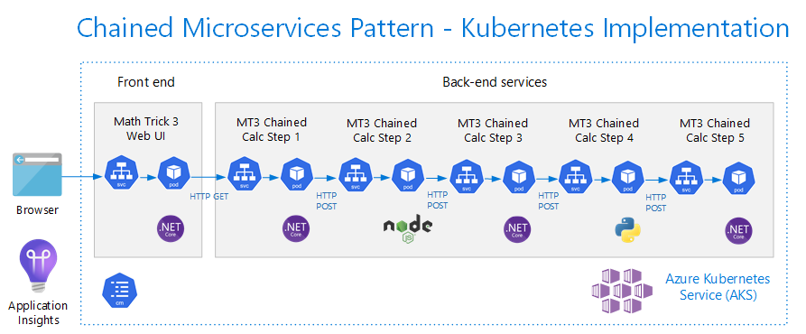

The **Gateway** folder contains the files related to the `Gateway Microservices Pattern` implementation of the Math Trick application (7 microservices total).

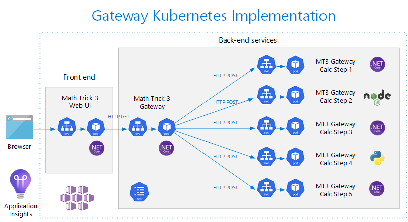

## Exercise: Create Additional Azure Resources

In this exercise you will create the external accounts needed to complete the rest of this lab.

### Task 1 - Create an Azure Container Registry

1. Define ACR name.

```PowerShell
$SUFFIX=(Get-Date -Format "MMddyy")
$ACR_NAME="acr$($YOUR_INITIALS)$($SUFFIX)"
Write-Host "ACR Name: $ACR_NAME"
```

> Note the **ACR Name**. You'll use it throughout the rest of this lab

1. Create an Azure Container Registry.

```PowerShell
$ACR_ID=$(az acr create --sku Premium --name $ACR_NAME --resource-group $AKS_RESOURCE_GROUP --query id -o tsv)

$ACR_ID
```

### Task 2 - Create an Azure Key Vault

The Azure Key Vault will be used to store the image tags of all the microservices.

While this key vault will not be needed until Module 5, it's a good idea to create it here when all the related variables are available.

1. Define variables.

```PowerShell
$KV_NAME="kv$($YOUR_INITIALS)"
Write-Host "Key Vault Name: $KV_NAME"
```

1. Note the **Key Vault Name**. You'll use it in lab 5.

1. Create an Azure Key Vault.

```PowerShell
az keyvault create --name $KV_NAME `
                   --resource-group $AKS_RESOURCE_GROUP `
                   --enable-rbac-authorization false `
                   --sku Standard
```

### Task 3 - Assign permissions to Azure Container Registry

1. Get Service Principal Ids from the managed identities of your AKS cluster.

```PowerShell
$AKS_ID=$(az ad sp list --display-name "$AKS_NAME" --query [0].appId -o tsv)
$AKS_POOL_ID=$(az ad sp list --display-name "$AKS_NAME-agentpool" --query [0].appId -o tsv)
```

1. Assign the AKS cluster **ACR Pull** permissions to your ACR.

```PowerShell
az role assignment create --role "AcrPull" --assignee $AKS_ID --scope $ACR_ID
az role assignment create --role "AcrPull" --assignee $AKS_POOL_ID --scope $ACR_ID
```

1. Verify the assignment in the Portal.

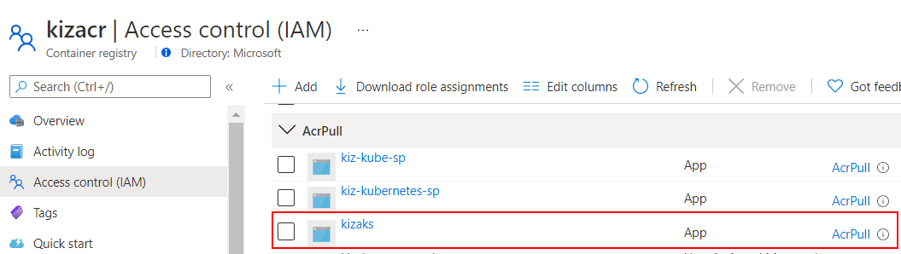

## Exercise: Use Helm to Deploy the Application

In this exercise you will use the Helm package manager to deploy an entire application in a single step, rather than applying individual manifest files.

### Task 1 - Build and push all the images to your ACR

Before you can deploy your application, the images must exist in a container registry.

1. Change the current folder to **MathTrick**.

```PowerShell
cd  C:\k8s\labs\MathTrick
```

1. Login into your ACR.

```PowerShell
az acr login --name $ACR_NAME  --expose-token
```

1. You can use ACR to build and push your images to the Azure Container Registry (itself). Run the script below. This operation will take 10-15 minutes because local base images are not cached between builds.

```powershell
.\buildmt3chainedallacr.ps1 -acrname $ACR_NAME
```

1. Verify all images have been built and pushed. Open your ACR in the Azure Portal.

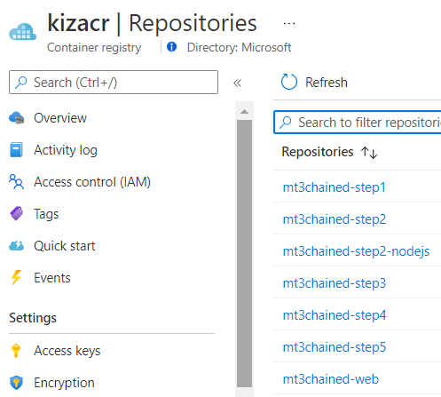

### Task 2 - Install a Helm Chart in your AKS cluster

1. Change current folder to **C:\k8s\labs\MathTrick\Chained\Helm\mt3chained**.

```PowerShell
cd  C:\k8s\labs\MathTrick\Chained\Helm\mt3chained
```

1. Examine the contents of **values.yaml**. This file defines the parameters Helm will use when it creates a release.

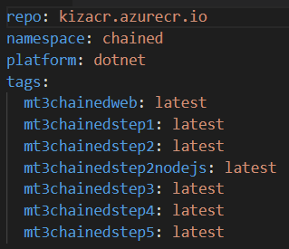

1. Change the name of the **repo** to your ACR name.

> When you install the chart to your cluster, the chart itself is saved to in the current namespace. This is not related to the namespace that's specified in your manifests. You may choose to keep all your charts in the default namespace, regardless of where the resources are deployed.

1. When Helm is used, it looks for the chart in a folder or a registered repo. Go up one folder to the **Helm** folder so the **mt3chained** folder is directly under it and can be specified as the source of the chart.

```PowerShell
cd  ..
```

1. Install the chart to your cluster. The release name doesn't matter. In this case, the chart name is the folder containing all the files and manifests.

```PowerShell
helm install chaineddemo mt3chained -n default
```

> As an alternative, you can use the `upgrade` command to install the chart if it doesn't exist. This allows you to same command for install and upgrade operations, which is very handy in DevOps.

```PowerShell
helm upgrade chaineddemo mt3chained -n default --install
```

1. Verify the pods have all been deployed to the cluster.

```PowerShell
kubectl get pods -n chained
```

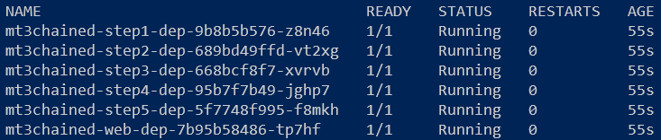

1. Get the External IP address of the service and open a browser with that address.

```PowerShell
kubectl get svc -n chained
```

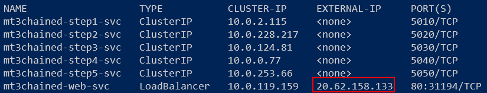

The site should come up in the browser:

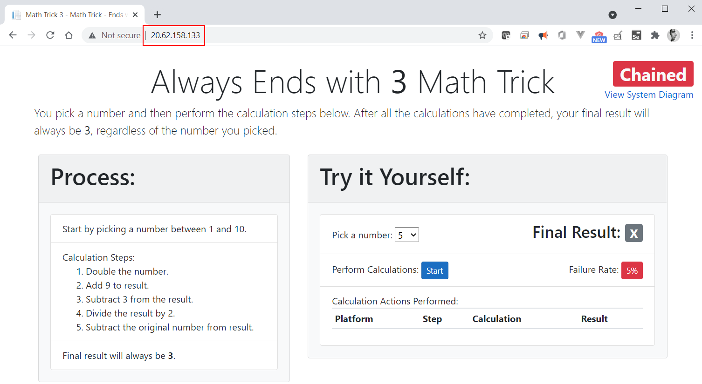

1. Click the **Start** button. If any of the steps return and error, click the **Start** button again. The results should be returned:

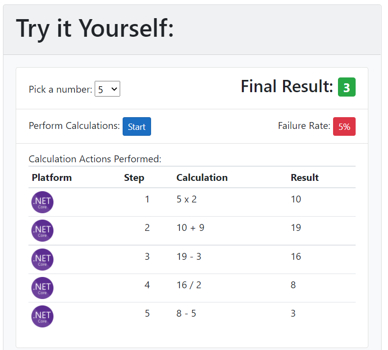

### Task 3 - Use Helm to deploy updates to your application

Use Helm to apply updates to your application when **ANYTHING** changes, without keeping track of those changes.

1. Open the **C:\k8s\labs\MathTrick\Chained\Helm\mt3chained\templates\mt3chained-web-dep.yaml** file in an editor. Go to the labels setion under "template" and add another label.

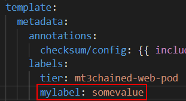

1. Upgrade the chart.

```PowerShell
helm upgrade chaineddemo mt3chained
```

1. Check the pods. Anytime there's a change to the **template** section, the pod is terminated and a new one is created.

```PowerShell
kubectl get pods -n chained
```

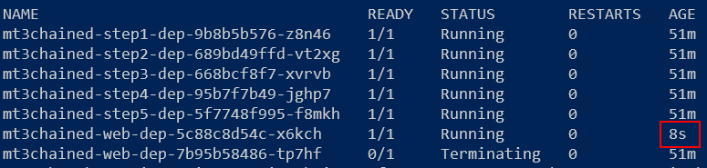

> Notice only the single pod has been recreated, while all the others have remained unchanged.

1. Open the **C:\k8s\labs\MathTrick\Chained\Helm\mt3chained\templates\mt3chained-cm.yaml** file in an editor. Change the **FAILURE_RATE** to a different whole number from 0 to 100. Save the file.

1. Open the **C:\k8s\labs\MathTrick\Chained\Helm\mt3chained\templates\mt3chained-web-dep.yaml** file in an editor. Notice the **annotations** value.

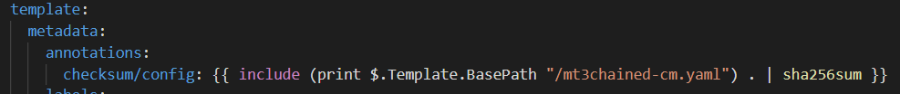

> When Helm parses this file, it gets the **sha256sum** value of the ConfigMap file and saves that value here. That means whenever the ConfigMap changes and the Helm chart is upgraded, a new value is written to the annotation. Since the change occurred in the **template** section, the pod will be recreated. Since all the deployments have the same code in the annotations section, as they all dependent on the values in the ConfigMap, all the pods will be recreated when you upgrade the chart after updating the ConfigMap.

1. Upgrade the chart.

```PowerShell
helm upgrade chaineddemo mt3chained
```

1. Check the pods. Notice all the pods have been recreated:

```PowerShell
kubectl get pods -n chained
```

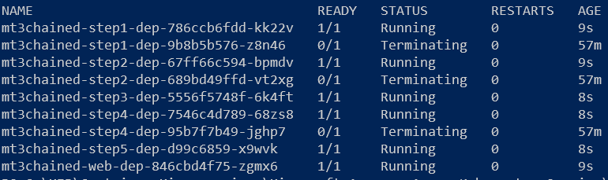

1. Open the **C:\k8s\labs\MathTrick\Chained\Helm\mt3chained\templates\steps\mt3chained-step2-dep.yaml** file in an editor. Notice the **containers** section.

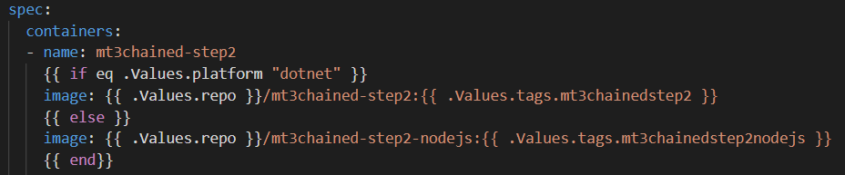

> When Helm renders this manifest file, it uses the value of the `platform` parameter to determine which container to use for this microservice. The defalt `platform` value is set to **dotnet**, which will cause the `.Net` container to be deployed. If **values.yaml** is updated or you overwrite the value in the command-line with any other value, the `Node JS` container will be used instead.

```PowerShell
helm upgrade chaineddemo mt3chained --set platform=multi
```

1. Wait for the image to be updated then run the calculations again on the website.

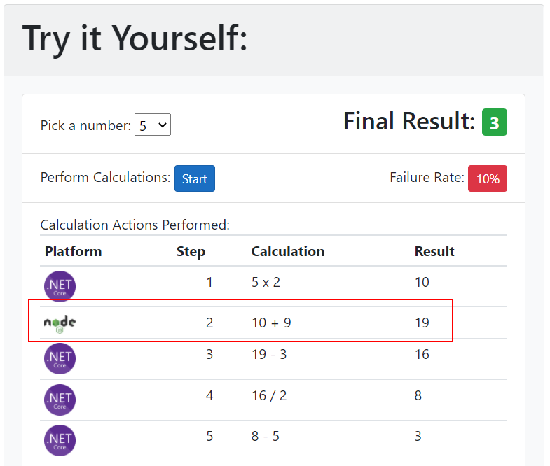

### Task 4 - Use Helm to control which files are included when the chart is updated

1. Open the **.helmignore** file. Notice it contains a single line. This tells Helm to ignore any file or folder that starts with an underscore (\_).

```helm
_*
```

1. In the **C:\k8s\labs\MathTrick\Chained\Helm\mt3chained\templates\steps** folder, rename the file **mt3chained-step3-dep.yaml** to **\_mt3chained-step3-dep.yaml**.

1. Upgrade the chart.

```PowerShell
helm upgrade chaineddemo mt3chained
```

1. Check the pods. Notice step 3 pod is gone:

```PowerShell
kubectl get pods -n chained
```

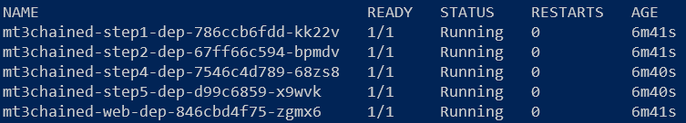

1. In the **C:\k8s\labs\MathTrick\Chained\Helm\mt3chained\templates\steps** folder, rename the file **\_mt3chained-step3-dep.yaml** back to **mt3chained-step3-dep.yaml**.
1. Rename the **steps** folder to **\_steps**.

1. Upgrade the chart.

```PowerShell
helm upgrade chaineddemo mt3chained
```

1. Check the pods. Notice **ALL** the steps pods are gone. The web front-end remains because its manifest is in the root folder.

```PowerShell
kubectl get pods -n chained
```

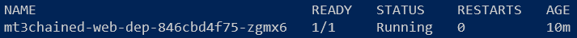

1. Rename the **\_steps** folder back to **steps**. Upgrade the chart. Check the pods. Notice all the pods come back as expected.

1. To uninstall your app as a whole, simply uninstall the release.

```PowerShell
helm uninstall chaineddemo
```

1. Check the all the resources. In about a minute or two, all the resources will be removed.

```PowerShell
kubectl get pods -n chained
```

## Exercise: Use Visual Studio 2019 to Debug Microservices Locally with Bridge to Kubernetes

When debugging an application, it's often not practical to run all the services and their dependencies locally. Instead, you can use **Bridge to Kubernetes** to connect to your cluster and swap out only the microservice you're currently working on.

### Task 1 - Prepare your microservice in Visual Studio 2019

1. Reinstall the application if you uninstalled it in the previous task.

```PowerShell
helm upgrade chaineddemo mt3chained -n default --install
```

1. Open Visual Studio 2019 (can be without code). To verify that `Bridge to Kubernetes` is installed, select **Extensions** and select `Online` list. Type in "bridge" in the search box. If the extension is installed, there will be a green check in the upper right-hand corner.

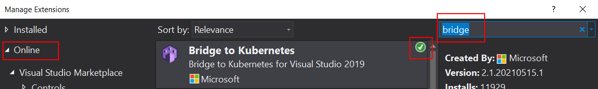

If it's not installed, go ahead and install it. Restart Visual Studio 2019.

1. Open the **MT3Chained-Step3** solution in the **C:\k8s\labs\MathTrick\Chained\MT3Chained-Step3** folder in Visual Studio 2019.

1. Run the project to make sure it's working correctly.

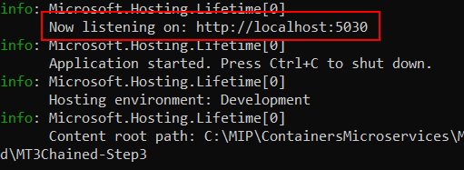

Take note of the Port the service is listening on.

1. Stop the debugger.

1. Open the `Services -> CalculationService.cs` file. Find the **CalculateStep** method and add 2 breakpoints at the locations indicated on the image:

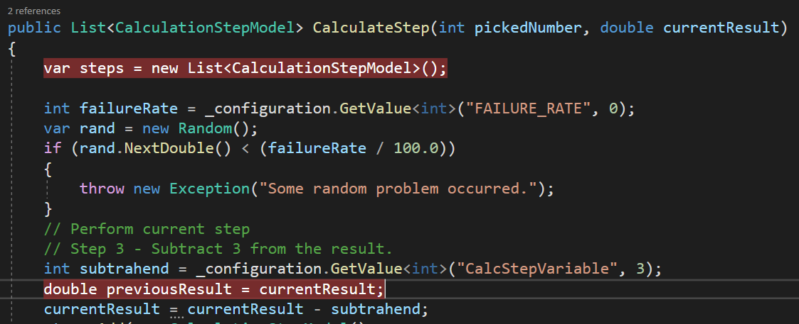

### Task 2 - Debug your microservice using Visual Studio 2019 and the Bridge to Kubernetes extension

1. Open the Profile option dropdown and click on **MT3Chained-Step3 Debug Properties**.

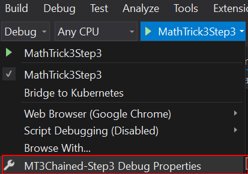

1. Select **Bridge to Kubernetes** from the Profile dropdown. Click the **Change** button.

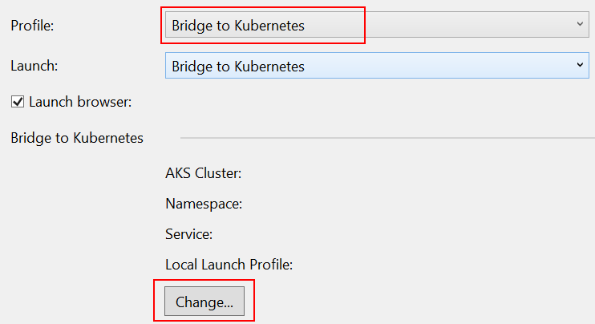

1. Select the cluster, namespace (`chained`) and service name (`mt3chained-svc`). Click the OK button when done configuring the parameters.

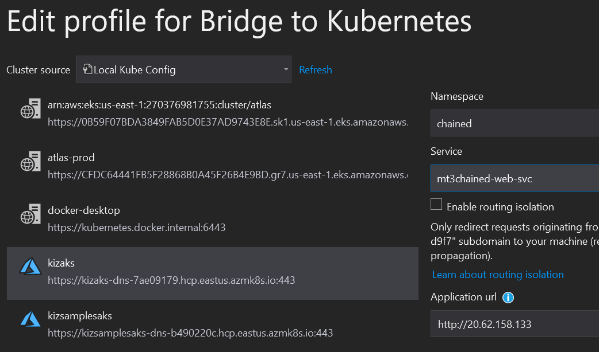

1. Select the **Bridge to Kubernetes** from the Debug profile dropdown and run it.

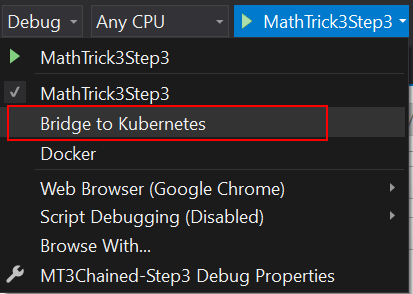

1. An **Endpoint Manager** dialog will be displayed requesting elevated priviledge to update your `hosts` file. Click the `OK` button.

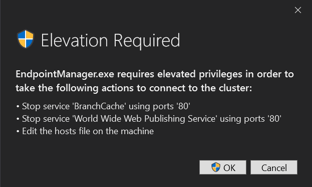

1. You may see a Windows Defender Firewall message. Click the `Allow access` button.

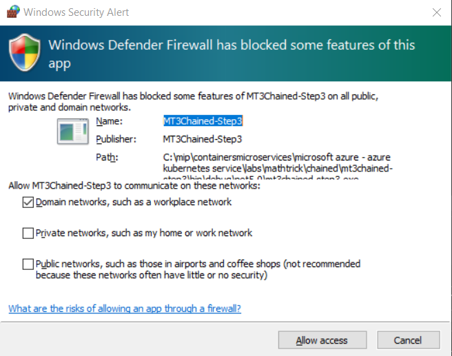

1. `Bridge to Kubernetes` will attempt to connect to your cluster. It may not work the first time, so please try again.

1. When you see the cluster has been connected, you are ready for debugging.

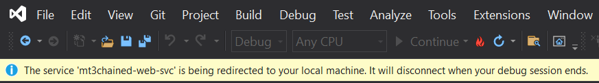

1. Watch the image in your deployment and know when Bridge to Kubernetes replaced it with its own.

```PowerShell
kubectl get deploy mt3chained-step3-dep -w -n chained -o=jsonpath='{$.spec.template.spec.containers[:1].image}'
```

1. Get the External IP of your Web service. Open a browser window with that IP. The site should come up as normal.

```PowerShell
kubectl get svc -n chained
```

1. Click the **Start** button. Breakpoint in your code should be triggered:

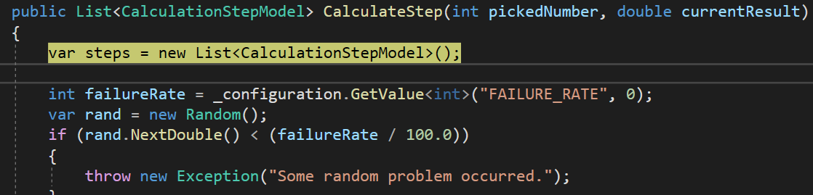

1. Open the `Output` window and take note of the environment variables from the pod have been transferred to your local machine.

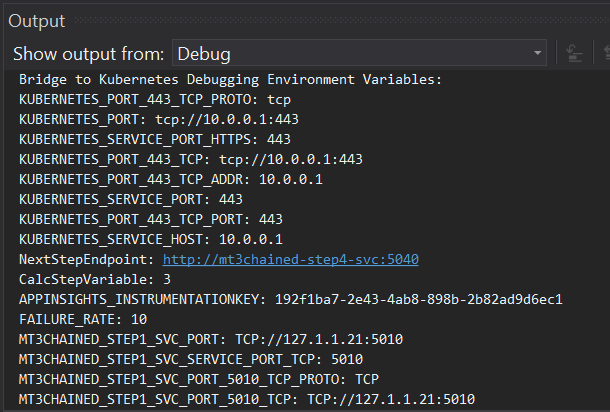

1. Click the `Continue` button to go to the next breakpoint.

1. Hover the mouse over the `subtrahend` variable and click on it to change it's current value to `333`. Press the `Enter` key.

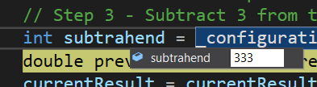

1. Click the `Continue` button. The service will finish processing locally and then call the next service in the chain, passing it the incorrect value. When the process finishes, the final results online will be incorrect.

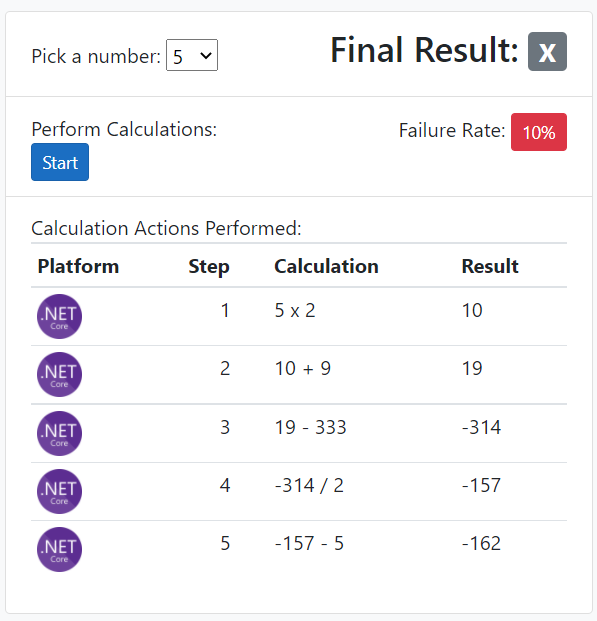

1. Your service replaced the microservice on the cluster and performed a different calculation. This was done without running the other services locally.

1. Stop your debug session. `Bridge to Kubernetes` will restore the previous image in the pod and the app will function as usualy.

1. Return to your browser and click the **Start** button again. You'll see the calculations are once again correct.

## Exercise: Use VS Code to Debug Microservices Locally with Bridge to Kubernetes

When debugging an application, it's often not practical to run all the services and their dependencies locally. Instead, you can use **Bridge to Kubernetes** to connect to your cluster and swap out only the microservice you're currently working on.

### Task 1 - Prepare your microservice in VS Code and verify that it runs locally

1. Reinstall the application if you uninstalled it in the previous task.

```PowerShell
helm upgrade chaineddemo mt3chained -n default --install
```

1. Open VS Code. To verify that `Bridge to Kubernetes` is installed, select **Extensions** and select the `Bridge to Kubernetes` extension.

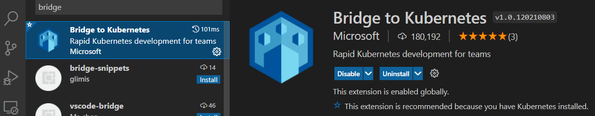

> If the extension is not installed, please install it. Restart VS Code.

1. Open the **C:\k8s\labs\MathTrick\Chained\MT3Chained-Step2-NodeJS** folder.

1. Run the microservice locally. In the `Debug Console` window, notice the local port the microservice is listening to. This will be used for redirection.

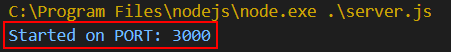

1. Stop the debugger.
1. Open **server.js** and set a breakpoint at the following line:

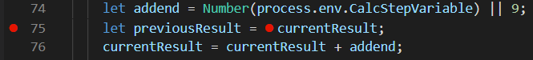

### Task 2 - Debug the microservice using VS Code and the Bridge to Kubernetes extension

1. The `Bridge to Kubernetes` extension in VS Code requires that the current namespce be set to the namespace you're working in. Cluster to use the correct namespace.

```PowerShell
kubectl config set-context –-current –-namespace chained
```

1. Open the `Command palette` (Ctrl+Shift+p) and run the "Bridge to Kubernetes: Configure"

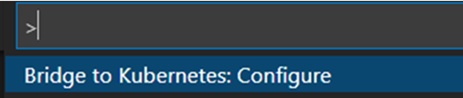

1. Select the **mt3Chained-step2** service.

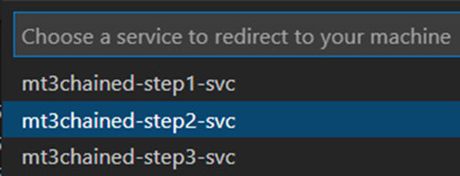

1. Enter **3000** as the port to redirect traffic to.

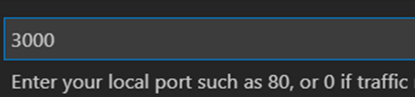

1. Select the existing configuration you tested with earlier. Bridge to Kubernetes will use this as the template for its configuration.

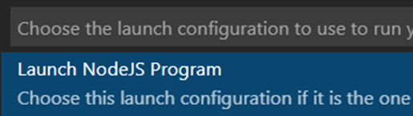

1. Select **No** for the Isolation mode.

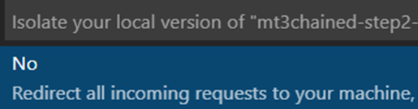

1. From the debug menu, run the new configuration:

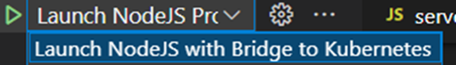

1. Answer **Yes** to any elevated privilege requests from `Endpoint Manager`.

> When Bridge to Kubernetes comes up, it shows the container port being redirected to the local port. All the other services in the namespace are redirected to local addresses (so that Endpoint Manager can send traffic back to the cluster). The bar at the bottom turn orange and it shows the currently active connection.

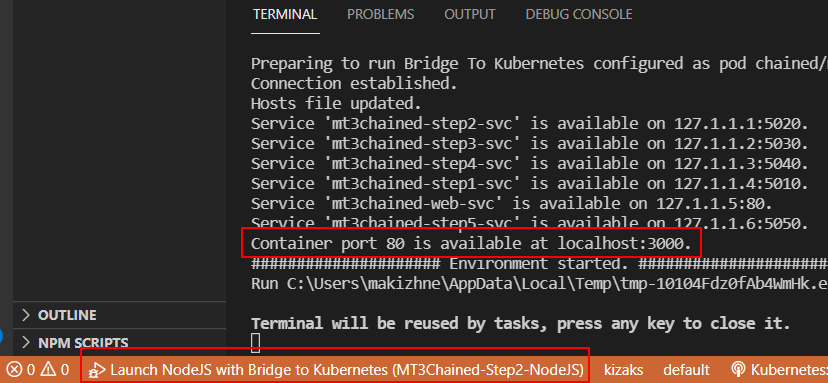

1. Watch the image in your deployment to know when `Bridge to Kubernetes` replaced it with its own and when it puts the original one back.

```PowerShell
kubectl get deploy mt3chained-step3-dep -w -n chained -o=jsonpath='{$.spec.template.spec.containers[:1].image}'
```

1. Get the `External IP` of your Web service. Open a browser window to that IP. The site should come up as normal.

```PowerShell
kubectl get svc -n chained
```

1. Click the **Start** button. Breakpoint in your code should be triggered:

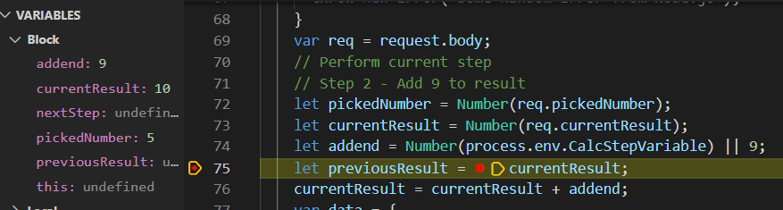

1. Double click on the `addend` field on the left and change the value from `9` to `99`.

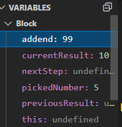

1. Click the `Continue` button in the debugger.
1. Return to the website page and confirm that the incorrect value was passed to other services and that the final result is wrong.

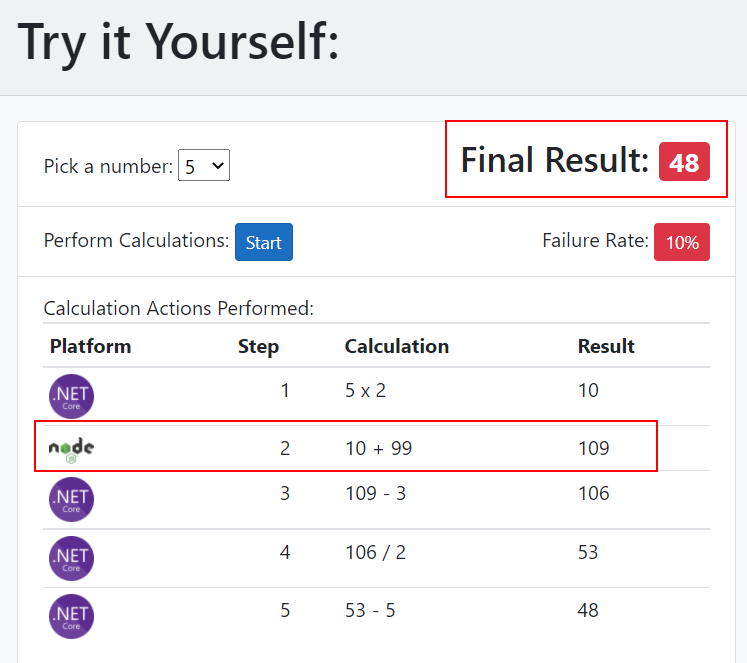

1. Stop the debugger. Bridge to Kubernetes will now restore the previous image in the pod and the app will function as usually.

1. Return to your browser and click the **Start** button again. You'll see the calculations are once again correct.

1. Restore your cluster back to the `default` namespace.

```PowerShell
kubectl config set-context –-current –-namespace default
```

**NOTES:**

If you remember from the Helm section, setting the value of `platoform` at the command line forces the `Node JS` container to be deployed for `step 2` instead of the default `.Net` version. However, no mention was made here about using a different platform value before running this debug session with the NodeJS service. Why?

How could you debug a Node JS microservice locally when a Node JS container isn't installed in the cluster prior to the session? It's because it doesn't matter what is installed in the cluster. The previous container could have been based on **`ANY IMAGE WHATSOEVER`** before it was replaced.

Bridge to Kubernetes replaces the container with its `routing manager` image for the duration of the debugging session. Then, when the session is over, it does a `rollout undo` to restore the original image back to the Deployment. At no time does Bridge to Kubernetes know (or care) what the previous container image was.

When creating a new microserivce, you can connect your local IDE to a cluster before even creating the `Dockerfile` for your microservice. Then test how the serivce will work `IF` you made it into a container and `IF` you deployed that container to the cluster. Simply create a `placeholder` deployment and service to deploy to the cluster and have Bridge to Kubernetes replace its container with the `routing manager` when you're debugging locally.

As you can tell, Bridge to Kubernetes can greatly enhance your Kubernetes microservice development and debugging experience.

## Exercise: Add Monitoring to Entire Application

Azure Application Insights can be configured to add monitoring across your entire application.

To integrate Application Insights into the code, follow these steps:

- Install the SDK for your platform : https://docs.microsoft.com/en-us/azure/azure-monitor/app/platforms
- Create an Application Insights instance in Azure or get the Instrumentation Key of an existing one.
- Configure the app to use the Instrumentation Key, either via a settings file or set it to known APPINSIGHTS_INSTRUMENTATIONKEY environment variable (all SDKs automatically look for this variable).
- Start/initialize the Application Insights process in your app.

That's it! When the application runs, the SDK will collect all types of metrics and log data and automatically send it to an Application Insights instance in Azure.

### Task 1 - Create an Application Insights and configure all the microservices to use it

> If you're installing both versions of the sample app (Chained and Gateway), make sure you create a separate Application Insights instance for each one.

1. Open the Azure portal.
1. Search for Application Insights.
1. Click the **Create** button. Give the instance a meaningful name, like `mt3chained-ai`.

1. When it's ready, go to the instance and take note of the `Instrumentation Key`

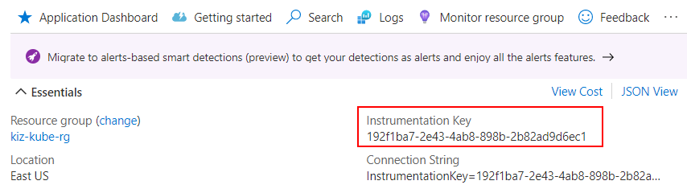

1. Open the **mt3chained-cm.yaml** file in the **C:\k8s\Labs\MathTrick\Chained\Helm\mt3chained\templates** folder.

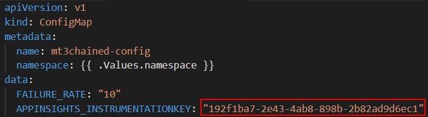

> Since all the microservices reference the same ConfigMap, they'll all have access to this environment variable. All the microservices have the SDK installed and running.

1. Upgrade the Helm chart.

1. Use your app for a few minutes. Open the Application Insights instance in Azure.
1. Select `Application Map` from the side menu. The diagram will look something like this, especially if multiple platforms were deployed.

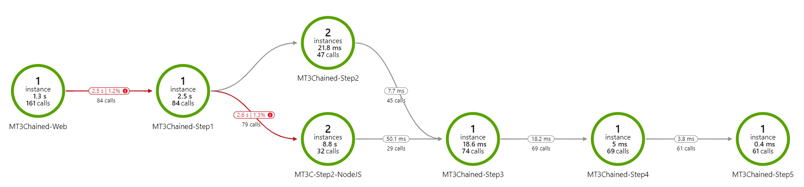

> The Application Map is automatically generated based on the structure of the application. It's used to verify that the application flow is correct.

> The "2" instances for `Step 2` are the result of using `Bridge to Kubernetes` to connect/disconnect from your cluster. Every time it disconnects and restores the old image, Kubernetes create a new instance of the pod, with a different IP. AI picks that up as a different instance.

1. If the **Gateway** pattern was used, the map will look something like this:

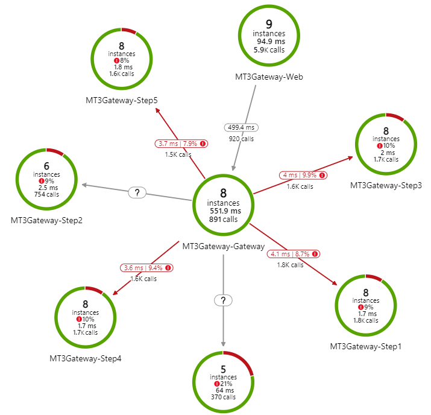

## DO NOT DELETE ANY OF THE AZURE RESOURCES YOU CREATED IN THIS LAB! ##

## YOU WILL USE THE SAME ACR AND AKS CLUSTER IN LAB 5 ##
