# Lab Module 5a: Azure DevOps: Application Deployment to Kubernetes


> Estimated Duration: 120 minutes

- [Lab Module 5a: Azure DevOps: Application Deployment to Kubernetes](#lab-module-5a-azure-devops-application-deployment-to-kubernetes)
  - [Exercise: Configure Azure DevOps](#exercise-configure-azure-devops)
    - [Task 1 - Azure DevOps: Create an Azure DevOps account and Math Trick 3 project](#task-1---azure-devops-create-an-azure-devops-account-and-math-trick-3-project)
    - [Task 2 - Configure Billing](#task-2---configure-billing)
    - [Task 3 - Create local git repo and ssh key](#task-3---create-local-git-repo-and-ssh-key)
    - [Task 4 - Configure your Azure DevOps connection and create the project](#task-4---configure-your-azure-devops-connection-and-create-the-project)
    - [Task 5 - Create the Service Connection to ACR](#task-5---create-the-service-connection-to-acr)
    - [Task 6 - Create the Service Connection to AKS](#task-6---create-the-service-connection-to-aks)
  - [Exercise: Create Basic CI/CD Pipeline with Azure DevOps](#exercise-create-basic-cicd-pipeline-with-azure-devops)
    - [Task 1 - Create the repos for the source code](#task-1---create-the-repos-for-the-source-code)
    - [Task 2 - Create the Build Pipeline](#task-2---create-the-build-pipeline)
    - [Task 5 - Update the Deployment manifest in the Build Pipeline](#task-5---update-the-deployment-manifest-in-the-build-pipeline)
    - [Task 6 - Create the Release Pipeline](#task-6---create-the-release-pipeline)
  - [Exercise: Create Complex Microservices CI/CD Pipelines Using Helm and Azure Key Vault](#exercise-create-complex-microservices-cicd-pipelines-using-helm-and-azure-key-vault)
    - [Background](#background)
    - [Task 1 - Create repos for the remaining microservices](#task-1---create-repos-for-the-remaining-microservices)
    - [Task 2 - Create Build Pipeline using YAML](#task-2---create-build-pipeline-using-yaml)
    - [Task 3 - Configure Key Vault created in Lab 4, Exercise 1, Task 2 to be used by your project](#task-3---configure-key-vault-created-in-lab-4-exercise-1-task-2-to-be-used-by-your-project)
    - [Task 4 - Update the Build Pipeline to store image tags in Azure Key Vault](#task-4---update-the-build-pipeline-to-store-image-tags-in-azure-key-vault)
    - [Task 5 - Build the Pipelines for the Web and NodeJS microservice](#task-5---build-the-pipelines-for-the-web-and-nodejs-microservice)
    - [Task 6 - Build a single Release Pipelines that uses Helm to update the AKS cluster](#task-6---build-a-single-release-pipelines-that-uses-helm-to-update-the-aks-cluster)

## Exercise: Configure Azure DevOps

Use this configuration to prepare Azure DevOps for either one of the following exercises.

Use the same ACR and AKS cluster you created for Lab 4.

### Task 1 - Azure DevOps: Create an Azure DevOps account and Math Trick 3 project

1. If you don't already have access to an Azure DevOps account, navigate to: <http://dev.azure.com>

1. Click the **Start free** button.

1. Use the same email you used to create the **Azure Pass subscription** to create an account.

1. Login to your new account

### Task 2 - Configure Billing

1. Select gear icon () **Organization settings**.

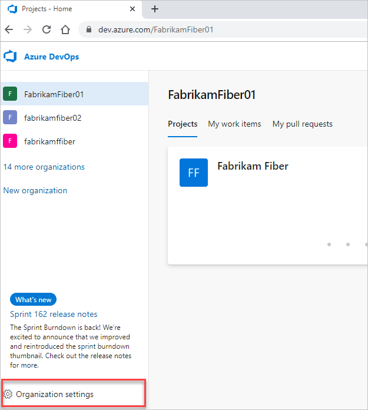

1. Select **Billing**.

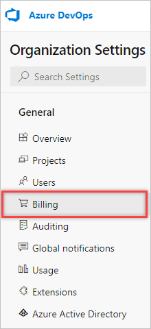

1. Select **Set up billing**.

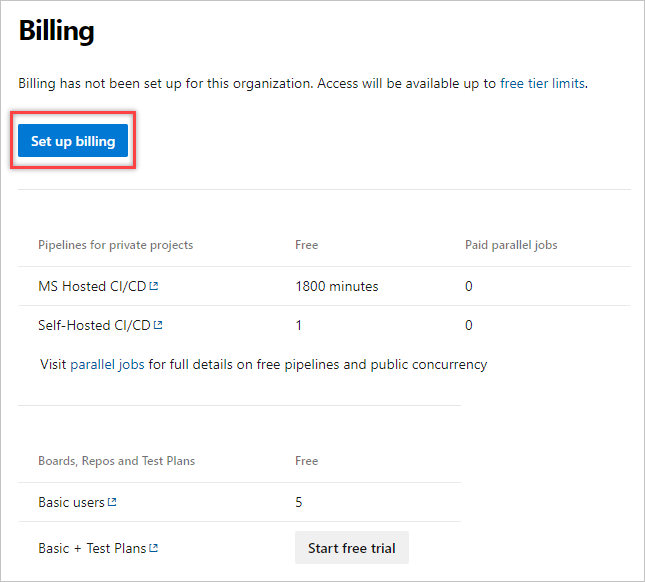

1. Select your **Azure Pass Subscription**, and then select *Save*.

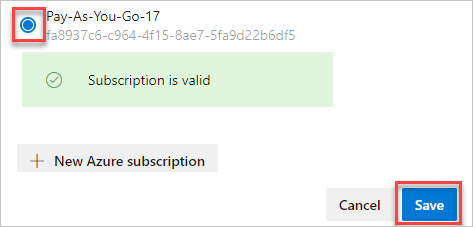

### Task 3 - Create local git repo and ssh key

1. Open a shell and change into the **C:\k8s\Labs\MathTrick\Chained\MT3Chained-Web** folder.

```PowerShell
cd C:\k8s\Labs\MathTrick\Chained\MT3Chained-Web
```

1. Initialize git and check in the source code.

```PowerShell
git init
git add .
git commit -m "Initial check-in"
```

The shell should look like this:

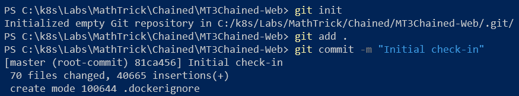

1. Generate an SSH key (use your email)

```PowerShell
ssh-keygen -C "myemail@mycompany.com"
```

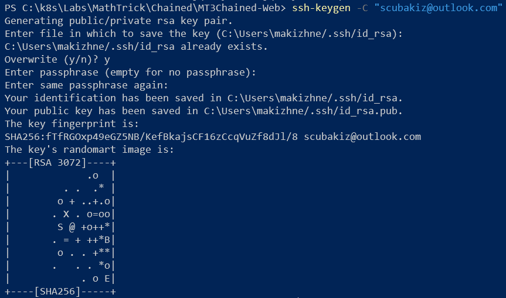

### Task 4 - Configure your Azure DevOps connection and create the project

1. Login to your Azure DevOps account.


1. Open your security settings by selecting your avatar in the upper right of the user interface. Select SSH public keys in the menu that appears.


1. Select **+ New Key**.

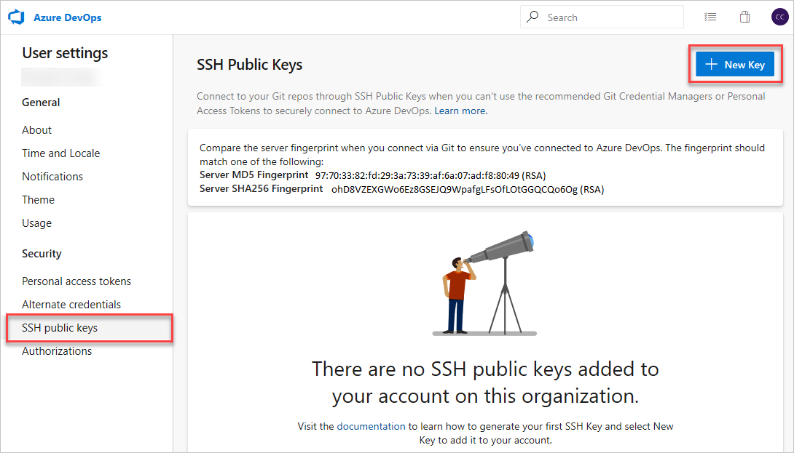

1. Copy the contents of the public key (for example, id_rsa.pub) that you generated into the Public Key Data field.  For example:

```PowerShell
cat /home/mark/.ssh/id_rsa.pub
```

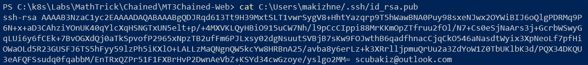


1. Return to the Project page by clicking on the Azure DevOps logo.  Click the **+ New Project** button to create a new project.  Call the project "Math Trick 3 - Chained".  Select **Private** for visibility and keep all the other defaults.


### Task 5 - Create the Service Connection to ACR

1. On your Azure DevOps page, **Project setting** at the bottom of the side menu.

1. Select **Service connections** from the side menu.  Click the **Create service connection** button.

1. Select **Docker Registry** from the available connection types

1. Select **Azure Container Registry** as the Registry type and login to your Azure account.  Call the connection "***ACR Connection***" and save it.

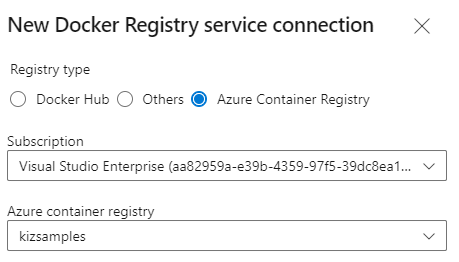

### Task 6 - Create the Service Connection to AKS

1. On your Azure DevOps page, **Project setting** at the bottom of the side menu.

1. Select **Service connections** from the side menu.  Click the **New service connection** button.

1. Select **Kubernetes**.

1. You can select Azure Subscription and login to your Azure account

1. Select you AKS cluster.

1. Select the **default** namespace.

1. As alternative, you can also copy and paste your **KubeConfig** file and select your context from there.  This is useful if your Kubernetes cluster is not hosted in Azure.

1. Call the connection "***AKS Connection***" and save it.

## Exercise: Create Basic CI/CD Pipeline with Azure DevOps

This exercise will go through the basics of Azure DevOps and how to create CI/CD Pipelines for Docker containers and deploy them to an AKS cluster.

### Task 1 - Create the repos for the source code

1. Select **Repos** from the side menu.


1. From the top Repos menu, click the down arrow and click "Manage Repositores".

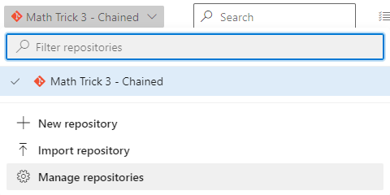

1. Click the **+ Create** button.  Create a new repository called "MT3Chained-Web".  **UNCHECK "Add a README"!**

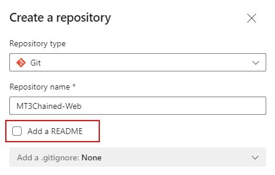

1. Ensure that the new repo is selected

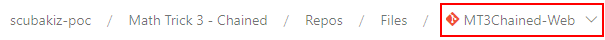

1. Select Repos again from the side menu.

1. Look for the **Push and existing repository from command line** section.  Change to the **SSH** tab and copy the commands in that section by clicking the copy button:

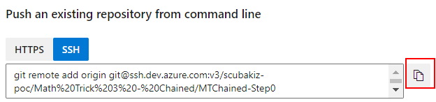

1. Go back to your Bash shell and paste those contents.

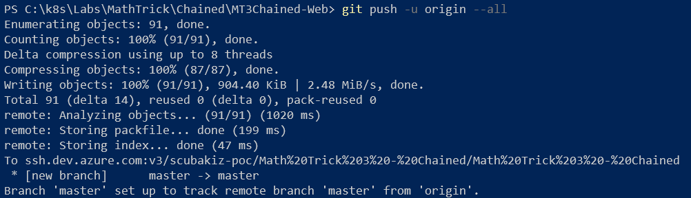

1. On your Azure DevOps page, select Repos again from the side menu.  You should see your files check in.

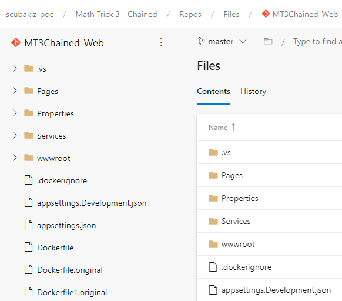

### Task 2 - Create the Build Pipeline

1. On your Azure DevOps page, select **Pipelines** from the side menu.  Click the **Create Pipeline** button.

1. Select the **Use the classic editor to create a pipeline without YAML.** option at the bottom.

1. Ensure the correct project and repo are selected and click **Continue**

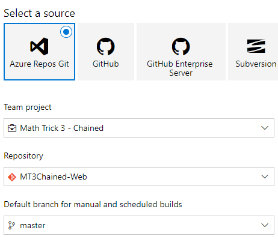

1. Select **Empty job** for the template.

1. Select **ubuntu-18.04** for the **Agent Specification**

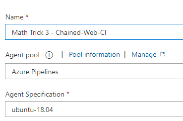

1. Change the name of the pipeline to "Math Trick 3 - Chained-Web-CI"

1. Click on the **Variables** option at the top.

1. Add a new variable called **imagename** and set its value to "mt3chained-web"

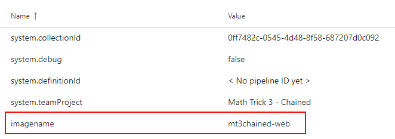

1. Click on the **Tasks** option at the top.

1. Click the **+** sign next to agent to add a task to the pipeline.

1. Search for "Docker" and select the **Docker** task.

1. Select the Service Connection you created earlier for you ACR in the **Container registry** field.

1. Enter "$(imagename)" in the **Container repository** field

1. Change the *Command* to **build**.

1. Click the **+** sign again and search for the same **Docker** task.

1. Select the Service Connection you created earlier for you ACR in the **Container registry** field.

1. Enter "$(imagename)" in the **Container repository** field

1. Change the *Command* to **push**

1. Click on the **Save & queue** button to run the pipeline

1. If everything worked correctly, your pipeline should complete successfully.

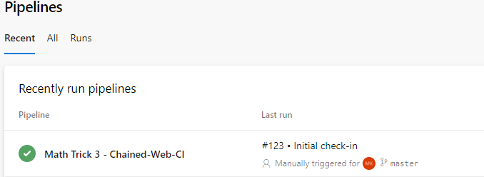

1. Open the Azure portal.  Go to your Container Registry.

1. Select **Repositories** and click on the image name you specified in your pipeline.  You should see your newly created image in the repository:

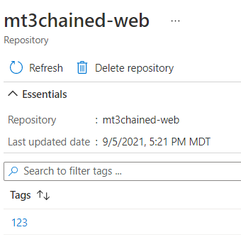

1. It's best practice to always create an image tagged as "latest" whenever you build push an image.  This can be done in the same pipeline, at the same time, without any additional steps.  All you have to do it specify an extra tag.

1. Return to your pipeline.  Click the **Edit** button

1. Add "latest" to the list of tags for BOTH the *build* and *push* tasks.

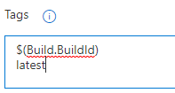

1. Before saving the pipeline, select **Triggers** on top menu.

1. Check "Enable continues intergration" checkbox.  Leave all the other defaults in place

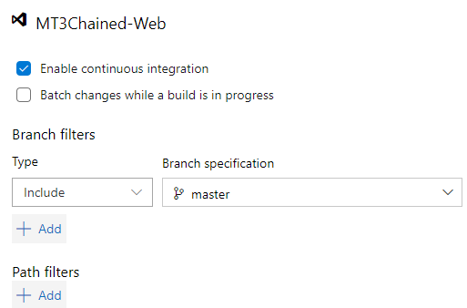

1. Select "Save" (NOT Save & Queue) from the top menu.

1. Return to the shell of the MT3Chained-Web folder.

1. Create a simple file just to trigger a change

```PowerShell
echo "Hello" > text.txt
```

1. Commit and push your changes.

```PowerShell
git add .
git commit -m "Added test file"
git push
```

1. Back in Azure DevOps, your pipeline should start running automatically.

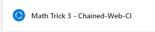

1. Wait a few minutes (without doing anything) and check you ACR in the Azure portal.

1. A new image with an updated build number should be there, along with the an image tagged as "latest"

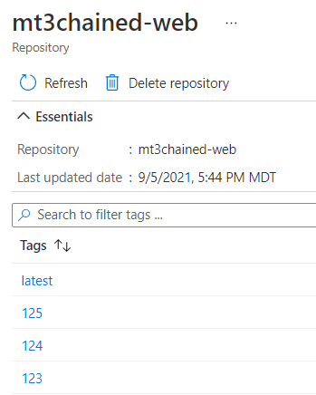

You now have a complete Docker image build pipeline, that triggers automatically when you update your code.

### Task 5 - Update the Deployment manifest in the Build Pipeline

Now that you have an image in your Azure Container Registry, it's time to create a Release pipeline to push it to AKS.

1. Go to your code folder on your local machine and open a file called **k8s-deployment.yaml** and examine the *containers:* section.

```yaml
  spec:
    containers:
    - name: mt3chained-web
      image: somecontainerrepo/mt3chained-web:latest
```

Notice that a placeholder has been placed for the name of the container registry.  This is likely not a valid registry, but it will be easy to find and replace with the name of a real one.

1. Edit your previous build pipeline.

1. Click the **+** sign next to the Agent and search for the **replace** task.  Notice the "RegEx Match & Replace" task.  This may be in the Marketplace section at the bottom if it's not already installed.  Go ahead and click the **Get it free** button and install it.

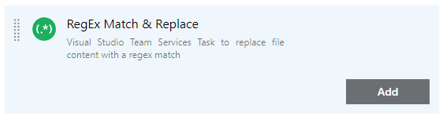

1. Click the **...** in the **Path to File** field and select the k8s-deployment.yaml file from your code.

1. Enter "***somecontainerrepo***" in the **Regular Expression to use** field.

1. Enter the full name of your container registry (ie. kizacr.azurecr.io) in the **Replacement value** field.

1. In addition to the registry name, you need to replace the tag number in the yaml with the build id that was generated during the build.

1. Add another "RegEx Match & Replace" task.  Select the same file.  Set the following field values, without quotes, but include starting ":"

- **Regular Expression to use** -> "*:latest*"
- **Replacement value** -> "*:$(Build.BuildId)*"

1. Now that the file has been updated, it needs to be saved as an *Artifact* so the Release pipeline and use it.

1. Click the **+** sign again and search for the **copy** task.

1. Select **Copy files** task.

1. Enter "*$(Build.SourcesDirectory)*" in the **Source Folder** field.

1. Enter "*.yaml" in the **Contents** field.  This will include all .yaml files in the root folder of your source code.

1. Enter "*$(Build.ArtifactStagingDirectory)*" in the **Target Folder** field.

1. Click the **+** sign again and search for **publish build** task.

1. Select the "Publish build artifacts" task.   You can accept all the default options.

1. Client the "Save & queue" button to launch a build.

1. When the build finishes, click on the build details

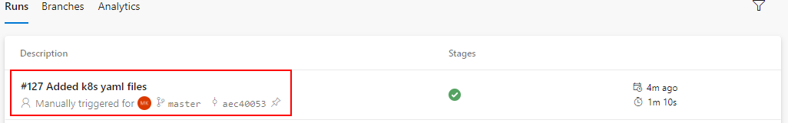

1. Look for a published artifact and click on it

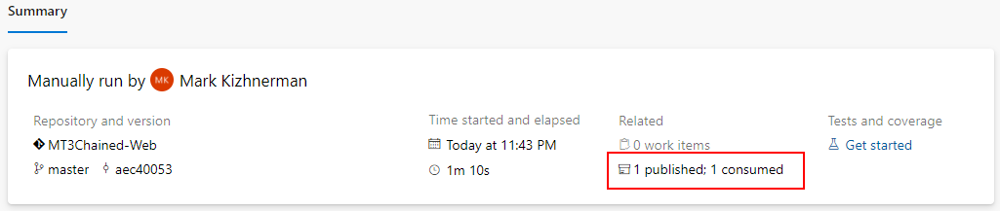

1. You should see the yaml files in the drop zip file.

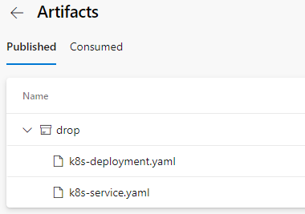

This *drop.zip* file is now available for the Release pipeline to apply to the Kubernetes cluster.

### Task 6 - Create the Release Pipeline

1. Select **Pipelines** from the side menu.

1. Select **Releases** under it on the side menu.

1. Click the **New Pipeline** button.

1. Select the **Empty job** template.

1. Give the pipeline a meaningful name and click the **+ Add** button in the *Artifacts** section.

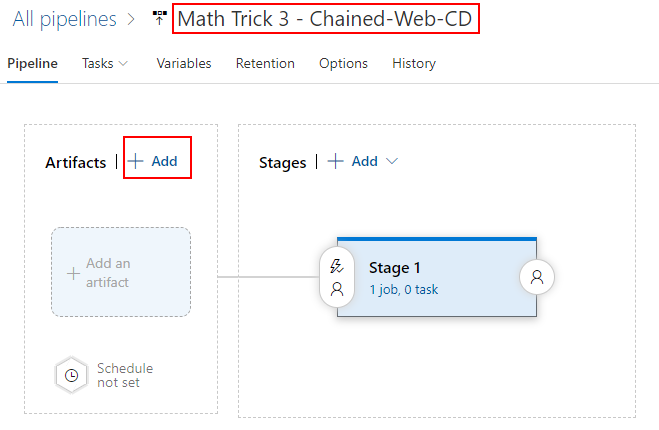

1. Select the **Source (build pipeline)**.  The other fields should automatically populate.  Click the Add button.

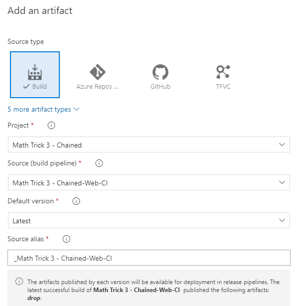

1. Click the lightning bolt in the upper-right corner of the artifact box to enable the "Continuous deployment trigger".

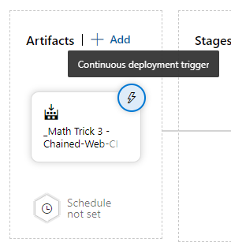

1. Enable the trigger.  This will generate a release whenever the artifacts have been updated.  Those artifacts are updated when the build pipeline completes.  That pipeline triggers when code is updated.  This completes the CI/CD sequence.

1. Under **Stage 1**, click the "1 job, 0 task" link.

1. Click the **+** button next to *Agent job*.  Search for "kubectl".  Select the **Kubectl** task.

1. Select your new service connection in the **Kubernetes service connection** dropdown.

1. Enter ***default*** in the **Namespace** field

1. Select ***apply*** from the **Command** dropdown

1. Check the **Use configuration** checkbox

1. Select "File path".  Click "..." and pick the "k8s-deployment.yaml" file in from your drop artifact.

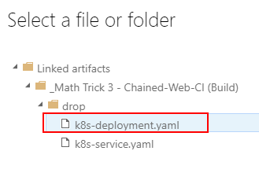

1. Your parameters should something like this:

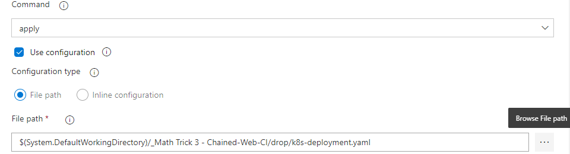

1. Click the **+** button again next to *Agent job*.  Search for "kubectl".  Select the **Kubectl** task.

1. Repeat the process above for the "*k8s-service.yaml*" file.

1. Save the pipeline.  Click the **Create release** button.

1. If everything was set correctly, your release pipeline should look like this:

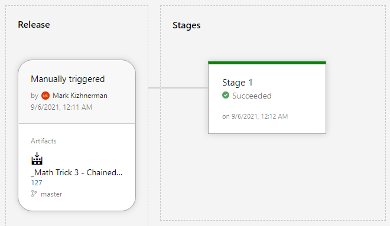

1. Open a shell and check your cluster for the expected resources:

```PowerShell
kubectl get all
```

1. The results should look something like this:

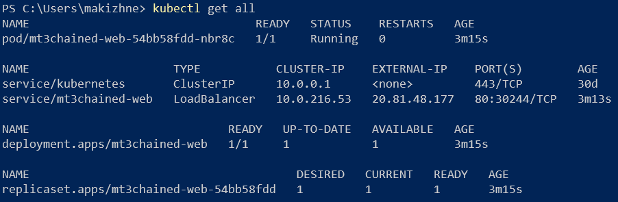

1. Once the **EXTERNAL-IP** for the "service/mt3chained-web" has been assigned a value (you may have to wait a few minutes), open a browser and enter that IP address in your address bar:

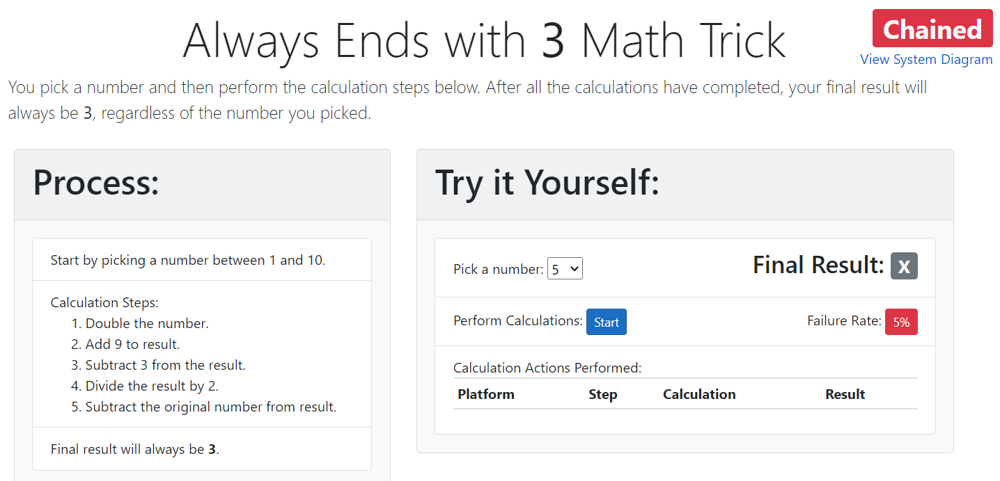

1. Verify that the correct image was deployed

```PowerShell
kubectl get pods -o jsonpath="{.items[*].spec.containers[*].image}"
```

You should see the full name of the image:

```PowerShell
kizacr.azurecr.io/mt3chained-web:129
```

1. Update the test text file you created earlier and check it.  Wait a few minutes and verify the deployed container in AKS has automatically updated.

**CONGRATULATIONS!!!** You just built a full CI/CD pipeline from code to Kubernetes.

## Exercise: Create Complex Microservices CI/CD Pipelines Using Helm and Azure Key Vault

### Background

Before creating the Git repos for the calculation step microservices, it's important to understand how the code projects of these microservices are structured.  Most of the .Net microservices access a common library called **MathTrickCore**.  This is a separate solution, but is referenced by .Net "step" projects (except the NodeJS and Python microservices).

The file structure contains the following hierarchy:

```
..\MathTrick
    \Chained
      \MT3Chained-Step1
        \MT3Chained-Step1.csproj
      \MT3Chained-Step2
        \MT3Chained-Step2.csproj
      ...
    \Gateway
      \MT3Gateway-Step1
        \MT3Gateway-Step1.csproj
      \MT3Gateway-Step2
        \MT3Gateway-Step2.csproj
      ...
    \MathTrickCore
      \MathTrickCore.csproj
```

Notice how the **MathTrickCore** is located 2 levels higher than any of the microservices projects.  This is an important consideration when working with the **Dockerfile**.  Docker files cannot access folder higher up in a hierarchy than the current folder (ie. Dockerfiles do not support references like ..\..\file).  That means for build process to work, the Dockerfile has to be run at the parent level (**\MathTrick**) so it can use that parent folder as its *context*:

```PowerShell
## Executed in the parent folder: .\Labs\MathTrick>
docker build -t "myacr.azurecr.io/mt3chained-step1:latest" --file "./Chained/MT3Chained-Step1/Dockerfile" .
```

To facilitate this type of build, the **Dockerfile** is setup to copy all of its files from the parent folder:

```dockerfile
...

FROM mcr.microsoft.com/dotnet/sdk:5.0 AS build
WORKDIR /src
COPY ["./Chained/MT3Chained-Step1/MT3Chained-Step1.csproj", "./Chained/MT3Chained-Step1/"]
COPY ["./MathTrickCore/MathTrickCore.csproj", "./MathTrickCore/"]
RUN dotnet restore "./Chained/MT3Chained-Step1/MT3Chained-Step1.csproj"
COPY . .

FROM build AS publish
WORKDIR "/src/."
RUN dotnet publish "./Chained/MT3Chained-Step1/MT3Chained-Step1.csproj" -c Release -o /app/publish
...
```

When you add all of these microservices to your Azure DevOps projects, the services will be in different repos, but most will reference the shared project.  You'll have to keep this file structure in mind when you check out multiple repos when building the Docker images.

> This structure does not apply to the Web UI project and the non-.Net microservices.  Those projects are self-contained.

### Task 1 - Create repos for the remaining microservices

In the previous exercise, you created an Azure DevOps Project and a repository for the Web microservice.  In this exercise, you'll expand that same project and create repositories for each of the remaining services.

1. Open Azure DevOps and click on the project you created previously.


1. Select **Repos** from the side menu.


1. From the top Repos menu, click the down arrow and click "**Manage Repositories**".

1. Click the **+ Create** button.  Create a new repository called "MT3Chained-Step1".  **UNCHECK "Add a README"!**

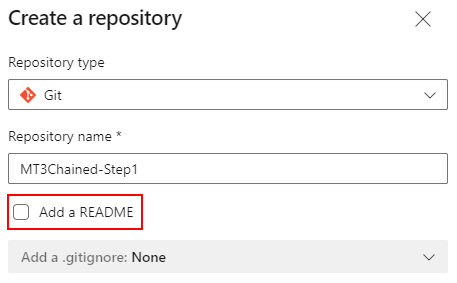

1. Repeat the process for the other services, including the Node JS service, but excluding the *Helm* folder (for now).


1. Create an additional repo called "**MathTrickCore**".  While you won't build this project directly, many of the other projects will need to reference it, so it should be in its own repo.

1. When you're done, you list should look like this:

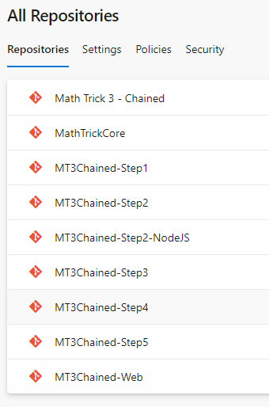

1. Open a shell and change into the **C:\k8s\Labs\MathTrick\Chained\MT3Chained-Step1** folder.

```PowerShell
cd C:\k8s\Labs\MathTrick\Chained\MT3Chained-Step1
```

1. Initialize git and check in the source code.

```PowerShell
git init
git add .
git commit -m "Initial check-in"
```

1. Return back to the project.  Select **Repos** from the side menu.

1. Ensure that the **MT3Chained-Step1** repo is selected at the top.

1. Look for the **Push and existing repository from command line** section.  Change to the **SSH** tab and copy the commands in that section by clicking the copy button:

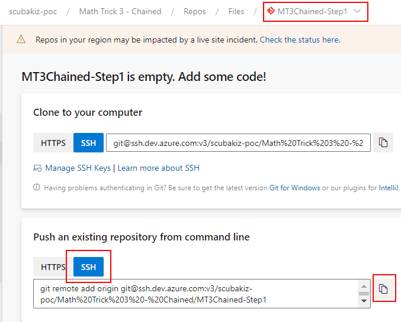

1. Go back to your Bash shell and paste those contents.

1. On your Azure DevOps page, select Repos again from the side menu.  You should see your files check in.

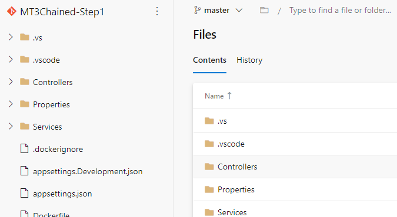

1. Repeat the process for all the microservices.

1. When you created the project, there was a new repo created with the same name as the project: "**Math Trick 3 - Chained**".  Use this repo to store the contents of the "**Helm**" folder.

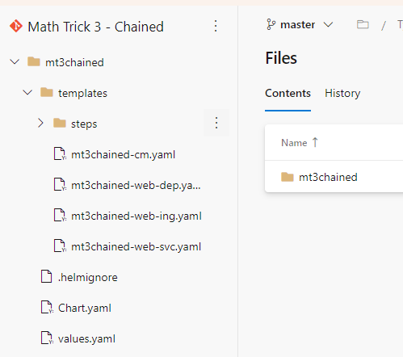

1. Change the folder to **C:\k8s\Labs\MathTrick\MathTrickCore**.

```PowerShell
cd C:\k8s\Labs\MathTrick\MathTrickCore
```

1. Repeat the check in/push process from above to the get the code into the **MathTrickCore** repo.

### Task 2 - Create Build Pipeline using YAML

1. On your Azure DevOps page

1. Select **Pipelines** from the side menu.  Click the **New Pipeline** button.

1. Select the **Azure Repo Git (YAML)**  option.

1. Select the **MT3Chained-Step1** repo from the list

1. Select the "Docker" pipeline template with a description of "Build and push an image to Azure Container Registry".

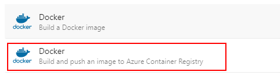

1. Select your subscription.  Login to Azure if prompted.

1. Select your container registry.

1. Enter "mt3chained-step1" as the image name.

1. Click the "Validate and Continue" button.

1. You're going to replace the contents of the pipeline yaml with a template included in this lab.  Open the file **C:\k8s\Labs\Module5\pipelines\build-pipeline-step1.yaml** in an editor.

1. The first part of the file lists which branch triggers the build.

```yaml
trigger:
- master
```

1. The *resources* section defines which repos to use in the build.  Since this pipeline will reference *step1* and ***MathTrickCore*** repos, both have to be defined here.

```yaml
resources:
  repositories:
  - repository: self
  - repository: MathTrickCore
    name: MathTrickCore
    type: git
```

1. The ***variables*** section lists all the setting used later in the build.  Update the variables below based on your settings.

```yaml
variables:
  dockerRegistryServiceConnection: 'ACRConnection'
  imageRepository: 'mt3chained-step1'
  containerRegistry: 'kizsamples.azurecr.io'
  dockerfilePath: '$(Agent.BuildDirectory)/Chained/MT3Chained-Step1/Dockerfile'
  selfRepoPath: 'Chained/MT3Chained-Step1'
  tag: 'v$(Build.BuildId)'
```

> Notice the *dockerfilePath* variable is set to a folder containing the file relative to the root.  In this case, the root will be **$(Agent.BuildDirectory)**.

1. The *vmImageName* indicates the image to use for the build agent.

```yaml
  vmImageName: 'ubuntu-latest'
```

1. The *stages* define the stages of the pipeline.  In this case, it will only contain the **build** stage.

```yaml
stages:
- stage: Build
  displayName: Build and push stage
  jobs:
  - job: Build
    displayName: Build
    pool:
      vmImage: $(vmImageName)
```

1. The *steps* section is where most of the work takes place in a pipeline.  The first two steps will checkout code from the two repositories and place them in specific folders, relative to the root.

```yaml
    steps:
    - checkout: MathTrickCore
      path: MathTrickCore
    - checkout: self
      path: Chained/MT3Chained-Step1
```

> Remember that the ***MathTrickCore*** folder has to be at the top level, which is where the Docker build context will be set.  Look at the folder structure of the source files in your local *labs* folder to confirm that this structure matches.

1. The *tasks* section execute the Docker **Build** and **Push** commands, using the variables defined previously.

```yaml
    - task: Docker@2
      displayName: Build and push an image to container registry
      inputs:
        command: buildAndPush
        repository: $(imageRepository)
        buildContext: $(Agent.BuildDirectory)
        dockerfile: $(dockerfilePath)
        containerRegistry: $(dockerRegistryServiceConnection)
        tags: |
          $(tag),latest
```

> Notice that there are multiple tags.  This will ensure that 2 images are built and pushed in the pipeline: current build and latest.

1. **Update the ACR name, the image repo and folder names in the file and copy its contents into the pipeline text in Azure DevOps.**

1. Save and run the pipeline.

1. The first time the pipelines run it needs permission to access the **MathTrickCore** repo.


1. Click the **View** button then **Permit**, then **Permit** again.

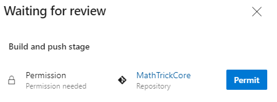

1. Assuming all the settings are correct, you should see 2 images in you Azure Container Registry

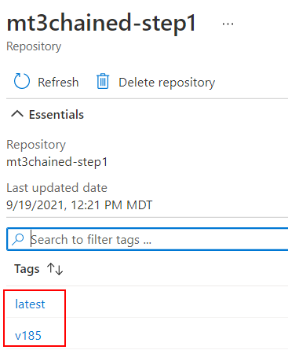

1. Repeat this entire task for all the ***step*** repos (excluding the NodeJS step).  Before you start, here are some tips to make the process easier:
    - Edit the Release Pipeline for Step 1 and copy its contents into an editor.  Edit the imagename and folder.  Use the version in the editor as the source of the yaml for each subsequent pipeline yaml.
    - When you create a new pipeline, choose "Starter pipeline" from the list of template.  This will come up much fast then the **Docker** template, which is nice since you'll simply replace all its yaml with the contents from the editor.


1. Do not create Build Pipelines for *MathTrickCore* and the *Helm* repos, as those projects are not built.

1. After all the builds have completed, verify all the images have been created in the ACR.

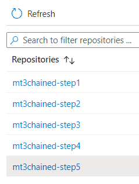

### Task 3 - Configure Key Vault created in Lab 4, Exercise 1, Task 2 to be used by your project

You created an Azure Key Vault in the previous module and set it's name in the **$KV_NAME** variable.

1. On your Azure DevOps page, **Project setting** at the bottom of the side menu.

1. Select **Service connections** from the side menu.  Click the **Create service connection** button.

1. Select **Azure Resource Manager** from the available connection types.

1. Select **Service principal (automatic)** for the Authentication Method.

1. Select **Subscription** for the Scope level.  Login into your subscription.

1. Select your subscription and Resource Group.

1. Call the service connection "**Azure Connection**" and save it.

1. When the service connection was created in Azure DevOps, it created a service principal in Azure to use during the connection.  You'll now need to give that service principal writes to update secrets in your key vault.

1. When the service connection has been created, click on it to view its details

1. Click on the "**Manage Service Principal**" link.

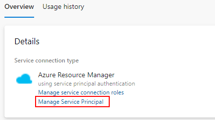

1. This action will ask you to login to Azure and take you to the newly create service principal.  Take note of the Application ID of the service principal.

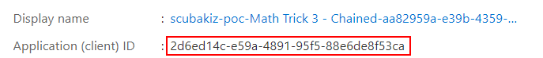

1. Save the value to a variable (replace with your Application ID)

```PowerShell
$SP_ID="2d6ed14c-e59a-4891-95f5-88e6de8f53ca"
```

1. Create an Access Policy to allow Azure DevOps to read and write secrets to the Key Vault

```PowerShell
$OBJ_ID=$(az ad sp show --id $SP_ID --query objectId -o tsv)
az keyvault set-policy --name $KV_NAME `
                       --resource-group $AKS_RESOURCE_GROUP `
                       --object-id $OBJ_ID `
                       --secret-permissions delete get list set
```

1. Open the Azure Portal, go to the Kay Vault and click on **Access policies** to verify the access policy was created

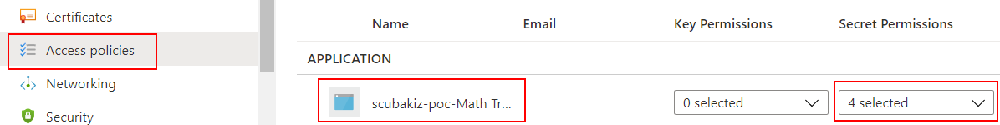

1. Create the default image tags secrets for all the images.  Set the default tags to *latest* so you can use them until they're replaced with the build numbers in the pipelines

```PowerShell
az keyvault secret set --vault-name $KV_NAME --name "mt3chained-step1-tag" --value "latest"
az keyvault secret set --vault-name $KV_NAME --name "mt3chained-step2-tag" --value "latest"
az keyvault secret set --vault-name $KV_NAME --name "mt3chained-step2-nodejs-tag" --value "latest"
az keyvault secret set --vault-name $KV_NAME --name "mt3chained-step3-tag" --value "latest"
az keyvault secret set --vault-name $KV_NAME --name "mt3chained-step4-tag" --value "latest"
az keyvault secret set --vault-name $KV_NAME --name "mt3chained-step5-tag" --value "latest"
az keyvault secret set --vault-name $KV_NAME --name "mt3chained-web-tag" --value "latest"
```

1. On the Key Vault in the Azure Portal, click on **Secrets** to verify they were all created (you may need to click *Refresh*)

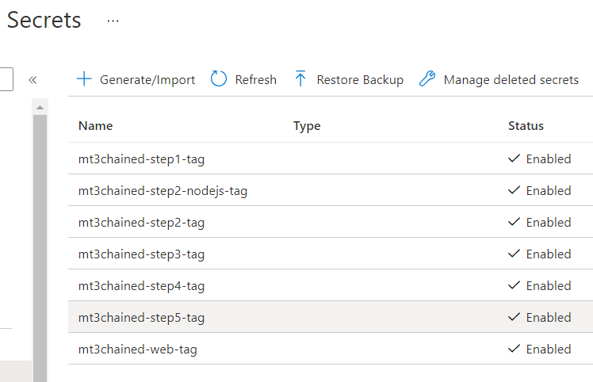

​

### Task 4 - Update the Build Pipeline to store image tags in Azure Key Vault

1. Edit the build pipeline create in Task 2.

1. Add 2 variables after the *tag*.  Replace the *vaultName* with your Key Vault name.

```yaml
  tag: 'v$(Build.BuildId)'
  vaultName: 'kvkizdsafjdsg'
  secretTagName: 'mt3chained-step1-tag'
```

> Notice the *secretTagName* matches the secret name created in the previous task.

1. Add another task to the end of your pipeline.  The pipeline will execute the same **az keyvault secret set** command that you executed above, except the *value* will be set to the current build tag.

```yaml
    - task: AzureCLI@2
      inputs:
        azureSubscription: 'Azure Connection'
        scriptType: 'bash'
        scriptLocation: 'inlineScript'
        inlineScript: |
          az keyvault secret set --vault-name "$(vaultName)" --name "$(secretTagName)" --value "$(tag)"
```

1. Your pipeline should look very similar to the complete version in **C:\k8s\Labs\Module5\pipelines\build-pipeline-step1-complete.yaml**.

1. Save and run the pipeline.

1. When the build completes successfully, go to the Azure Portal and look up the secrets in the key vault.

1. Click on the link below the **CURRENT VERSION** of the secret.  Click the **Show Secret Value** button

1. The latest build tag should be in the value of the secret.

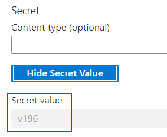

1. Which should match the latest tag in the ACR repository


1. Repeat the previous steps for all the .Net ***step*** microservices (not Web or NodeJS), specifying the correct tag name in each pipeline.  You can do this quickly by coping your completed pipeline into an editor and simply changing the variables that are specific to each step.  All the others (*containerRegistry*, *serviceConnection*, etc.) will remain the same.

### Task 5 - Build the Pipelines for the Web and NodeJS microservice

1. To avoid confusion, **delete** the Build and Release pipelines created for the *MT3Chained Web* project in the first exercise of this lab:  <u>**Exercise: Create Basic CI/CD Pipeline with Azure DevOps**</u>
1. Repeat the process you followed in Task 2 above, by creating a new Build pipeline for *MT3Chained Web* project, but this time use the **C:\k8s\Labs\Module5\pipelines\build-pipeline-web-complete.yaml** file as your starting template.
1. Notice this file is much simpler than the microservices ones because it only uses a single repo.  Since the default paths are used, the root folder is defined by a different variable called **$(Build.SourcesDirectory)**
1. Update the variables section with your setting:

```yaml
variables:
  dockerRegistryServiceConnection: 'ACR Connection'
  imageRepository: 'mt3chained-web'
  containerRegistry: 'kizsamples.azurecr.io'
  dockerfilePath: '$(Build.SourcesDirectory)'
  tag: 'v$(Build.BuildId)'
  vaultName: 'kvkizdsafjdsg'
  secretTagName: 'mt3chained-web-tag'
```

1. Save and run the pipeline.

1. When complete, verify the images in your  Azure Container Registry and the tags in your Azure Key Vault.

1. Repeat the process for the NodeJS project by using the **C:\k8s\Labs\Module5\pipelines\build-pipeline-step2-nodejs-complete.yaml** as your template.

1. When all the pipeline have run at least once, you can verify their status by selecting "Pipelines" and clicking the *All* link on top.


### Task 6 - Build a single Release Pipelines that uses Helm to update the AKS cluster

Now that all of the microservice images are automatically built, push and their tags are saved, it's time to build a release pipeline that triggers automatically and updates the AKS cluster when **ANY** microservice is updated.

1. On your Azure DevOps page, select **Pipelines** from the side menu.  Click the **Releases** button.

1. Click the **+ New** button then select **New release pipeline**.

1. Select the **Empty job** template

1. Change the name of the pipeline to "**Deploy Math Trick 3 Chained App to AKS**"

1. In the artifacts section, add the build you created for the microservices


1. Repeat the process for **<u>all</u>** the builds.


1. Click the lightning bolt to set the *Continuous deployment trigger*


1. Enable the trigger.


1. Repeat the process for all the artifacts.  This means your release pipeline will fire when **ANY** microservice is updated.

1. You now need a copy of the Helm chart files in order to deploy them.  You can pull those files direcly from the repo without creating a Build Pipeline first.

1. Add the Helm chart as another Artifact.  Select *Azure Repo* as the *Source type* and pick the repo matching the project name, which is where the Helm chart was added.


1. Enable *Continuous deployment trigger* in the lightning bolt.  This means all changes to the Helm chart (new files added/removed/modified) will also trigger a deployment.

1. In the *Stages* section, click on the link that under the **Stage 1** label


1. Click on the *Agent Job* line and update the *Agent Specification* to use an **ubuntu-18.04** OS


1. Click the **+** and add the **Azure Key Vault** task.


1. Select the **Azure Connection** you created earlier and then select your Key vault

1. Leave "*" for the *Secrets filter*.  Click the *Make secrets available to whole job* checkbox.

> This task will import all the secrets that match the filter into variables available to the job.  Those variables will have the same name as the secrets.

1. Click the **+** and add the **RegEx Match & Replace** task.

1. In the *Path to File* field, select the **values.yaml** file in the main repo.


1. Remember the **values.yaml** file contains placeholders for all the microservice tags

Original **values.yaml**:

```yaml
tags:
  mt3chainedweb: latest
  mt3chainedstep1: latest
  mt3chainedstep2: latest
  mt3chainedstep2nodejs: latest
  mt3chainedstep3: latest
  mt3chainedstep4: latest
  mt3chainedstep5: latest
```

The goal of this task is to replace all those placeholders with the real tags.

1. In the *Regular Expression to use* field enter "**mt3chainedweb: latest**"
1. In the *Replacement value* field enter "**mt3chainedweb: $(mt3chained-web-tag)**"
1. Right-click on the **RegEx Match & Replace** task and select "Clone task(s)"
1. Repeat the process for all the microservices by replacing the tags with their variable values, that were automatically created by the **Asure Key Vault** task.

> If you right-click on the  **RegEx Match & Replace** task, you'll see the option to ***clone task(s)***.  This will make the duplicating process much faster.

1. Add an extra task to replace "**repo: kizacr.azurecr.io**" with the name of your ACR repo.
1. The final step in the process is to update/install the Helm chart in your cluster.
1. Click the **+** and add the **Package and deploy Helm Charts** task.
1. Select the same **Azure Connection** you created earlier.  Select the Resource Group and Kubernetes Cluster.
1. Enter "**default**" in the **Namespace** field.  The Helm chart will take care of installing the services in the correct namespace.
1. Select **upgrade** in the **Command** field.
1. Set "**File Path**" for the **Chart Type** field.
1. Select the folder of the chart in the **Chart Path** field.


1. Enter "**chained**" in the **Release Name** field.
1. Enter "**--install**" in the **Arguments** field.
1. Save the pipeline and click the *Create release* link.
1. Assuming the pipeline succeeds, check the cluster to verify everything has been deployed and is running.

```PowerShell
kubectl.exe get all -n chained
```


1. Open a browser and enter the EXTERNAL-IP address listed for the Load Balancer service.
1. Click the Start button to ensure all the services are connected.


1. Verify that the Helm pipeline used all the tags from the Key Vault and replaced all the tags successfully, including the ACR.

```PowerShell
helm get values chained -a
```


1. Finally, confirm that the entire process is working correctly by adding a test file in any microservice and check it in.

> Make sure to pull before pushing, as the pipeline yaml will be added to your repo.

```PowerShell
## Change into any of the microservice folders

echo "Test" > pipeline.txt
git add .
git commit -m "Pipeline test"
git pull

```


1. Wait a few minutes to ensure that **ONLY** that effected Pod was automatically replaced with the new version.

```PowerShell
kubectl.exe get all -n chained
```


**CONGRATULATIONS!!!**  You now have a "practical" pipeline you can use as a template for complex microservices applications.
