# Lab Module 5b: GitHub: Application Deployment to Kubernetes

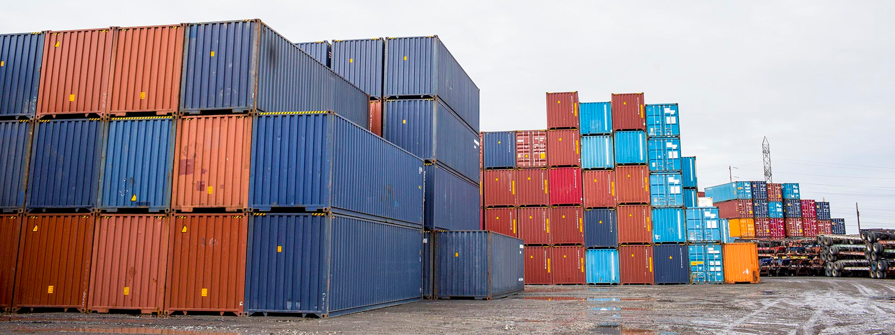

> Estimated Duration: 120 minutes

- [Lab Module 5b: GitHub: Application Deployment to Kubernetes](#lab-module-5b-github-application-deployment-to-kubernetes)
  - [Exercise: Configure GitHub](#exercise-configure-github)
    - [Task 1 - Create a GitHub account](#task-1---create-a-github-account)
    - [Task 2 - Create a ssh key](#task-2---create-a-ssh-key)
    - [Task 3 - Configure your GitHub SSH Key](#task-3---configure-your-github-ssh-key)
  - [Exercise: Create a GitHub Repository](#exercise-create-a-github-repository)
    - [Task 1 - Create a local git repo for the MT3Chained-Web folder](#task-1---create-a-local-git-repo-for-the-mt3chained-web-folder)
    - [Task 2 - Create the GitHub repo for the local MT3Chained-Web repo](#task-2---create-the-github-repo-for-the-local-mt3chained-web-repo)
  - [Exercise: Create the Secrets for the GitHub repo](#exercise-create-the-secrets-for-the-github-repo)
    - [Task 1 - Create a service principal and grant it access to the AKS resource group](#task-1---create-a-service-principal-and-grant-it-access-to-the-aks-resource-group)
    - [Task 2 - Create the GitHub Action Secret to manage the AKS cluster and the Azure Key Vault](#task-2---create-the-github-action-secret-to-manage-the-aks-cluster-and-the-azure-key-vault)
    - [Task 3 - Create the GitHub Actions Secrets for the Azure Container Registry Authentication](#task-3---create-the-github-actions-secrets-for-the-azure-container-registry-authentication)
  - [Exercise: Create a Basic CI/CD Pipeline with GitHub Actions](#exercise-create-a-basic-cicd-pipeline-with-github-actions)
    - [Task 1 - Create the GitHub Action](#task-1---create-the-github-action)
    - [Task 2 - Add in the workflowyaml the latest image tag](#task-2---add-in-the-workflowyaml-the-latest-image-tag)
  - [Exercise: Add a Kubernetes Deploy Step to the Workflow YAML](#exercise-add-a-kubernetes-deploy-step-to-the-workflow-yaml)
    - [Task 1 - Deploy the new workflow yaml](#task-1---deploy-the-new-workflow-yaml)
  - [Exercise: A Complex Microservices CI/CD Pipelines Using Helm and Azure Key Vault](#exercise-a-complex-microservices-cicd-pipelines-using-helm-and-azure-key-vault)
    - [Background](#background)
    - [Task 1 - Create repos for the remaining microservices](#task-1---create-repos-for-the-remaining-microservices)
    - [Task 2 - Initialize git, check in the source code and push it to GitHub (For all the repos, excluding the NodeJS step and web repo)](#task-2---initialize-git-check-in-the-source-code-and-push-it-to-github-for-all-the-repos-excluding-the-nodejs-step-and-web-repo)
    - [Task 3 - Add the same secrets you added in the Exercise: Create the Secrets for the GitHub repo](#task-3---add-the-same-secrets-you-added-in-the-exercise-create-the-secrets-for-the-github-repo)
    - [Task 4 - Create a GitHub Token](#task-4---create-a-github-token)
    - [Task 5 - Create a new GitHub Action for the step repos](#task-5---create-a-new-github-action-for-the-step-repos)
    - [Task 6 - Configure the service principal to access the Key Vault created in Lab 4, Exercise 1, Task 2 to be used by your workflows](#task-6---configure-the-service-principal-to-access-the-key-vault-created-in-lab-4-exercise-1-task-2-to-be-used-by-your-workflows)
    - [Task 7 - Update the Build Pipelines to store image tags in Azure Key Vault](#task-7---update-the-build-pipelines-to-store-image-tags-in-azure-key-vault)
    - [Task 8 - Build the Pipelines for the Web and NodeJS microservice](#task-8---build-the-pipelines-for-the-web-and-nodejs-microservice)
    - [Task 9 - Build a single Release Pipelines that uses Helm to update the AKS cluster](#task-9---build-a-single-release-pipelines-that-uses-helm-to-update-the-aks-cluster)
    - [Task 10 - Push the changes](#task-10---push-the-changes)

## Exercise: Configure GitHub

Use this configuration to prepare GitHub for either one of the following exercises.

Use the same ACR, Azure Key Vault and AKS cluster you created for **Lab 4**.

### Task 1 - Create a GitHub account

1. If you don't already have access to a GitHub account, navigate to: <https://github.com>

2. Click on sign up.

3. Use an email of your choice to create an account.

4. Login to your new account.

### Task 2 - Create a ssh key

1. Generate a SSH key (use your email) and **DO NOT ENTER A PASSPHRASE**.

```PowerShell
ssh-keygen -C "myemail@mycompany.com"
```

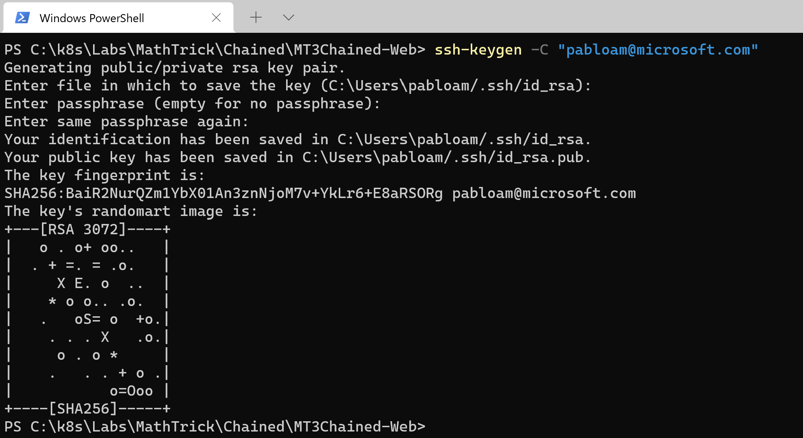

### Task 3 - Configure your GitHub SSH Key

1. If you haven't already done so, login to your GitHub account.

2. Select your avatar in the upper right of the user interface and then click on **Settings** in the menu that appears.


3. Click on **SSH and GPG keys** and **New SSH key**.


4. Copy the content of the public key (for example, id_rsa.pub) that you generated in your local.

```PowerShell
cat C:\Users\pabloam\.ssh\id_rsa.pub
```


5. Name it as ssh key in the **Title section** and paste the content in the **Key** section. Finally, click on **Add SSH key**.

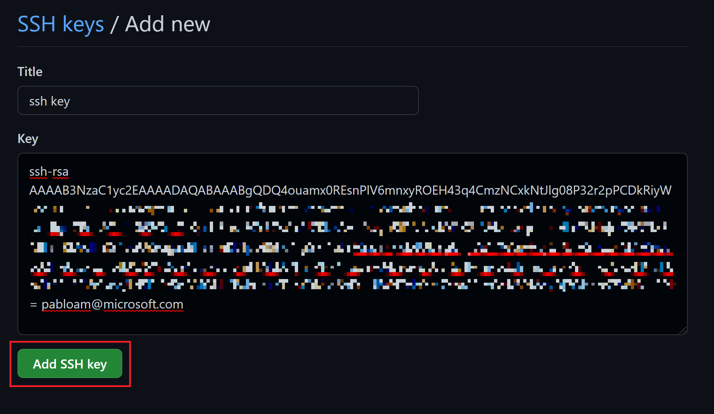

## Exercise: Create a GitHub Repository

### Task 1 - Create a local git repo for the MT3Chained-Web folder

1. Open the Windows Terminal and change into the **C:\k8s\Labs\MathTrick\Chained\MT3Chained-Web** folder.

```PowerShell
cd C:\k8s\Labs\MathTrick\Chained\MT3Chained-Web
```

2. Initialize git and check in the source code.

```PowerShell
git init
git add .
git commit -m "Initial check-in"
```

The shell should look like this:


### Task 2 - Create the GitHub repo for the local MT3Chained-Web repo

1. Go to the GitHub principal page and Select **New** from the left side.


2. Create a new repository called "MT3Chained-Web". **CHECK "Private"** and click on **Create Repository** button.

3. In the next window copy the following commands.


4. Go back to your Windows Terminal and paste those contents and enter yes.


5. Refresh the GitHub page, you should see your local files.


## Exercise: Create the Secrets for the GitHub repo

### Task 1 - Create a service principal and grant it access to the AKS resource group

We will create the secrets with Service Principal values, so first we must create a Service Principal.

1. Login to Azure with PowerShell.

```PowerShell
Connect-AzAccount
```

2. Use your user email and password.


3. Create a Service Principal and assign it the Contributor role in your resource group (AKS Resource Group). You just have to copy the following Azure PowerShell code and paste it in the Windows Terminal.

```PowerShell
$resourceGroupId = (Get-AzResourceGroup -Name $AKS_RESOURCE_GROUP).ResourceId

$SP_NAME="sp-aks-$($YOUR_INITIALS)$SUFFIX"

Write-Host "Service Principal Name:" $SP_NAME

$azureContext = Get-AzContext

$servicePrincipal = New-AzADServicePrincipal `
-DisplayName $SP_NAME `
-Role Contributor `
-Scope $resourceGroupId

$output = @{
   clientId = $($servicePrincipal.ApplicationId)
   clientSecret = $([System.Net.NetworkCredential]::new('', $servicePrincipal.Secret).Password)
   subscriptionId = $($azureContext.Subscription.Id)
   tenantId = $($azureContext.Tenant.Id)
}

$output | ConvertTo-Json
```

4. The script output should look like this:


5. Copy the script output in a .txt file, since it will be used in the next steps.

You've created the service principal. Next, create secrets in the GitHub Repository.

### Task 2 - Create the GitHub Action Secret to manage the AKS cluster and the Azure Key Vault

1. In your browser, navigate to your GitHub repository (**MT3Chained-Web**).

2. Select Settings > Secrets > Actions.

3. Select New repository secret.


4. Name the secret as **AZURE_CREDENTIALS**.

5. In the **Value** field, paste the JSON object that you copied in the .txt file in the previous section.

6. Click **Add secret**.


### Task 3 - Create the GitHub Actions Secrets for the Azure Container Registry Authentication

1. Select New repository secret.

2. Name the secret as **ACR_CLIENT_ID**.

3. In the **Value** field, paste the **"clientId"** value of the JSON object that you copied in the previous section in the .txt file.

4. Select **Add secret**.


5. Select New repository secret.

6. Name the secret as **ACR_CLIENT_PASSWORD**.

7. In the **Value** field, paste the **"clientSecret"** value of the JSON object that you copied in the previous section in the .txt file.

8. Click **Add secret**.


## Exercise: Create a Basic CI/CD Pipeline with GitHub Actions

### Task 1 - Create the GitHub Action

1. To create a GitHub Action, you need to have a **workflow.yaml** in the **C:\k8s\Labs\MathTrick\Chained\MT3Chained-Web\\.github\workflows** directory. Now there is a file **workflow-web1.yaml** in the **C:\k8s\Labs\Module5\workflows** directory  with the following content:

> This workflow build, tag, and push the web image to your Azure Container Registry.

```yaml
name: Math Trick 3 - Chained-Web-CI

on:
  push:
    branches:
      - main

env:
  APP_NAME: <appName>
  LOGIN_SERVER: <acrServerName>

jobs:

  build:
    runs-on: ubuntu-latest
    steps:

      - name: Check Out Repo
        uses: actions/checkout@v2

      # Connect to Azure Container Registry (ACR)
      - name: ACR login
        uses: azure/docker-login@v1
        with:
          login-server: ${{ env.LOGIN_SERVER }}
          username: ${{ secrets.ACR_CLIENT_ID }}
          password: ${{ secrets.ACR_CLIENT_PASSWORD }}

      # Container build and push to a Azure Container Registry (ACR)
      - name: Build, tag, and push image to ACR
        uses: docker/build-push-action@v2
        with:
          context: ./
          file: Dockerfile
          push: true
          tags: |
            ${{ env.LOGIN_SERVER }}/${{ env.APP_NAME }}:${{ github.run_number }}
          ## <latestTag> ##
```

> Take in to account that all the workflow.yaml created in this lab will run whenever you push a change in the main branch of the GitHub repository.

```yaml
on:
  push:
    branches:
      - main
```

2. Obtain the Azure Container Registry Server Name.

```PowerShell
$ACR_SERVER_NAME=(az acr show -n $ACR_NAME --query loginServer -o tsv)
```

3. Create the **\.github\workflows** folder in the path **C:\k8s\Labs\MathTrick\Chained\MT3Chained-Web**.

```PowerShell
New-Item -Path "C:\k8s\Labs\MathTrick\Chained\MT3Chained-Web\.github\workflows" -ItemType Directory
```

4. Replace the **workflow-web1.yaml** file with the correct values and create the right file **workflow.yaml** in the right path.

```PowerShell
$Path1="C:\k8s\Labs\Module5\workflows"
$Path2="C:\k8s\Labs\MathTrick\Chained\MT3Chained-Web\.github\workflows"
$original_file = (Join-Path $Path1 workflow-web1.yaml)
$destination_file = (Join-Path $Path2 workflow.yaml)
(Get-Content $original_file) | Foreach-Object {
    $_ -replace "<appName>", "mt3chained-web" `
       -replace "<acrServerName>", $ACR_SERVER_NAME
    } | Set-Content $destination_file
```

5. Push the changes to your GitHub Repository.

```PowerShell
git add .
git commit -m "Create the workflow.yaml"
git push
```

6. Now you can see your GitHub Action in the Actions tab of your Repository.

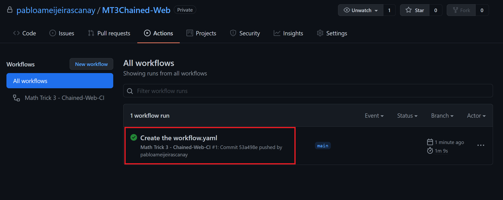

7. Click on **Create the workflow.yaml** and then click on build, you can see all the steps of your job.

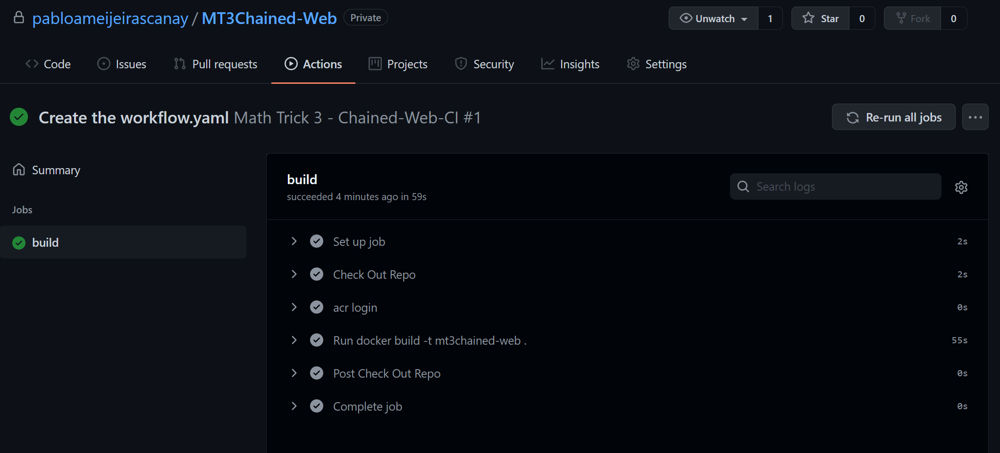

> This GitHub Action build an image with a Dockerfile and push that image to your Azure Container Registry, the name of the image is specified in the Environment variable **APP_NAME: mt3chained-web**, and the image tag is the **github.run_number**.

8. Go to the Azure Portal and check your Azure Container Registry Repositories.


9. Click on the **mt3chained-web** Repository and you can see your tag.


### Task 2 - Add in the workflowyaml the latest image tag

1. Open the Windows Terminal and run te following command to add the lastest tag.

```PowerShell
(Get-Content (Join-Path $Path2 workflow.yaml)).replace("## <latestTag> ##", '  ${{ env.LOGIN_SERVER }}/${{ env.APP_NAME }}:latest') | Set-Content (Join-Path $Path2 workflow.yaml)
```
> **`NOTE:`** This script replaces the string **## \<latestTag> ##** in the workflow.yaml with the right code to add the latest image tag.

2. Push the changes to your GitHub Repository.

```PowerShell
git add .
git commit -m "Update the image tags in the workflow.yaml"
git push
```

3. Now you can see your new workflow run in the Actions tab of your GitHub Repository.


4. Go to the Azure Portal and check your Azure Container Registry Repositories.


5. Click on the **mt3chained-web** Repository and you can see the two new tags (the tag **2** appears because you run the workflow.yaml again, so it creates a new **github.run_number**).


## Exercise: Add a Kubernetes Deploy Step to the Workflow YAML

### Task 1 - Deploy the new workflow yaml

1. To create a the new GitHub Action, you need to upgrade the **workflow.yaml** content in the **C:\k8s\Labs\MathTrick\Chained\MT3Chained-Web\\.github\workflows** directory. Now there is a file **workflow-web2.yaml** in the **C:\k8s\Labs\Module5\workflows** directory  with the following content:

> This workflow does the same as the last one, but with one more step to deploy the app in the AKS cluster.

```yaml
name: Math Trick 3 - Chained-Web-CI

on:
  push:
    branches:
      - main

env:
  APP_NAME: <appName>
  LOGIN_SERVER: <acrServerName>
  CLUSTER_NAME: <clusterName>
  CLUSTER_RESOURCE_GROUP: <clusterResourceGroup>
  NAMESPACE: <namespaceName>

jobs:

  build-and-deploy:
    runs-on: ubuntu-latest
    steps:

      - name: Check Out Repo
        uses: actions/checkout@v2

      # Connect to Azure Container Registry (ACR)
      - name: ACR login
        uses: azure/docker-login@v1
        with:
          login-server: ${{ env.LOGIN_SERVER }}
          username: ${{ secrets.ACR_CLIENT_ID }}
          password: ${{ secrets.ACR_CLIENT_PASSWORD }}

      # Container build and push to a Azure Container Registry (ACR)
      - name: Build, tag, and push image to ACR
        uses: docker/build-push-action@v2
        with:
          context: ./
          file: Dockerfile
          push: true
          tags: |
            ${{ env.LOGIN_SERVER }}/${{ env.APP_NAME }}:${{ github.run_number }}

      # Set the target Azure Kubernetes Service (AKS) cluster.
      - uses: azure/aks-set-context@v1
        with:
          creds: '${{ secrets.AZURE_CREDENTIALS }}'
          cluster-name: ${{ env.CLUSTER_NAME }}
          resource-group: ${{ env.CLUSTER_RESOURCE_GROUP }}

      # Create namespace if doesn't exist
      - run: |
          kubectl create namespace ${{ env.NAMESPACE }} --dry-run -o json | kubectl apply -f -
      # Deploy app to AKS
      - uses: azure/k8s-deploy@v1
        with:
          manifests: |
            k8s-deployment.yaml
            k8s-service.yaml
          images: |
            ${{ env.LOGIN_SERVER }}/${{ env.APP_NAME }}:${{ github.run_number }}
          namespace: ${{ env.NAMESPACE }}
```

2. Copy the next script in the terminal to replace the **workflow-web2.yaml** file with the right values and copy the content to the right file called **(workflow.yaml)** in the right path **(C:\k8s\Labs\MathTrick\Chained\MT3Chained-Web\\.github\workflows)**.

```PowerShell
$Path1="C:\k8s\Labs\Module5\workflows"
$Path2="C:\k8s\Labs\MathTrick\Chained\MT3Chained-Web\.github\workflows"
$original_file = (Join-Path $Path1 workflow-web2.yaml)
$destination_file = (Join-Path $Path2 workflow.yaml)
(Get-Content $original_file) | Foreach-Object {
    $_ -replace "<appName>", "mt3chained-web" `
       -replace "<acrServerName>", $ACR_SERVER_NAME `
       -replace "<clusterName>", $AKS_NAME `
       -replace "<clusterResourceGroup>", $AKS_RESOURCE_GROUP `
       -replace "<namespaceName>", "default"
    } | Set-Content $destination_file
```

3. Now replace in the manifest **k8s-deployment.yaml** the server name of your ACR.


Copy the next script in your Windows Terminal.

```PowerShell
$Path="C:\k8s\Labs\MathTrick\Chained\MT3Chained-Web"
(Get-Content (Join-Path $Path k8s-deployment.yaml)).replace("somecontainerrepo", $ACR_SERVER_NAME) | Set-Content (Join-Path $Path k8s-deployment.yaml)
```

4. Push the changes to your GitHub Repository.

```PowerShell
git add .
git commit -m "Update the the workflow.yaml and k8s-deployment.yaml"
git push
```

5. Now you can see your new workflow run in the Actions tab of your GitHub Repository.


6. Copy the next command in the terminal to check your cluster for the expected resources:

```PowerShell
kubectl get all
```

7. The output should look like this:


8. Once the EXTERNAL-IP for the "service/mt3chained-web" has been assigned a value (you may have to wait a few minutes), open a browser and enter that IP address in your address bar:


9. Verify that the correct image was deployed

```PowerShell
kubectl get pods -o jsonpath="{.items[*].spec.containers[*].image}"
```

You should see the full name of the image:

```PowerShell
acrpacyowrfzcd.azurecr.io/mt3chained-web:3
```

10. Return to the Windows Terminal in the MT3Chained-Web folder.

11. Create a simple file just to trigger a change in the main branch.

```PowerShell
echo "Hello" > text.txt
```

12. Commit and push your changes.

```PowerShell
git add .
git commit -m "Add a test file"
git push
```

13. Wait a few minutes and verify the deployed container in AKS has automatically updated. Verify what image was deployed

```PowerShell
kubectl get pods -o jsonpath="{.items[*].spec.containers[*].image}"
```

You should see the full name of the image:

```PowerShell
acrpacyowrfzcd.azurecr.io/mt3chained-web:4
```

**CONGRATULATIONS!** You just built a full CI/CD pipeline from code to Kubernetes.

## Exercise: A Complex Microservices CI/CD Pipelines Using Helm and Azure Key Vault

### Background

Before creating the Git repos for the calculation step microservices, it's important to understand how the code projects of these microservices are structured.  Most of the .Net microservices access a common library called **MathTrickCore**. This is a separate solution, but is referenced by .Net "step" projects (except the NodeJS and Python microservices).

The file structure contains the following hierarchy:

```
..\MathTrick
    \Chained
      \MT3Chained-Step1
        \MT3Chained-Step1.csproj
      \MT3Chained-Step2
        \MT3Chained-Step2.csproj
      ...
    \Gateway
      \MT3Gateway-Step1
        \MT3Gateway-Step1.csproj
      \MT3Gateway-Step2
        \MT3Gateway-Step2.csproj
      ...
    \MathTrickCore
      \MathTrickCore.csproj
```

Notice how the **MathTrickCore** is located 2 levels higher than any of the microservices projects. This is an important consideration when working with the **Dockerfile**. Docker files cannot access folder higher up in a hierarchy than the current folder (ie. Dockerfiles do not support references like ..\\..\file). That means for build process to work, the Dockerfile has to be run at the parent level (**\MathTrick**) so it can use that parent folder as its *context*:

```PowerShell
## Executed in the parent folder: .\Labs\MathTrick>
docker build -t "myacr.azurecr.io/mt3chained-step1:latest" --file "./Chained/MT3Chained-Step1/Dockerfile" .
```

To facilitate this type of build, the **Dockerfile** is setup to copy all of its files from the parent folder:

```dockerfile
...

FROM mcr.microsoft.com/dotnet/sdk:5.0 AS build
WORKDIR /src
COPY ["./Chained/MT3Chained-Step1/MT3Chained-Step1.csproj", "./Chained/MT3Chained-Step1/"]
COPY ["./MathTrickCore/MathTrickCore.csproj", "./MathTrickCore/"]
RUN dotnet restore "./Chained/MT3Chained-Step1/MT3Chained-Step1.csproj"
COPY . .

FROM build AS publish
WORKDIR "/src/."
RUN dotnet publish "./Chained/MT3Chained-Step1/MT3Chained-Step1.csproj" -c Release -o /app/publish
...
```

When you add all of these microservices to your GitHub Account, the services will be in different repos, but most will reference the shared project.  You'll have to keep this file structure in mind when you check out multiple repos when building the Docker images.

> This structure does not apply to the Web UI project and the non-.Net microservices. Those projects are self-contained.

### Task 1 - Create repos for the remaining microservices

In the previous exercise, you created a repository for the Web microservice. In this exercise, you'll create repositories for each of the remaining services.

1. Open GitHub and click on the GitHub avatar to go home, then click on **New**.


2. Create a new repository called "MT3Chained-Step1". **CHECK "Private"** and click the **Create Repository** button.

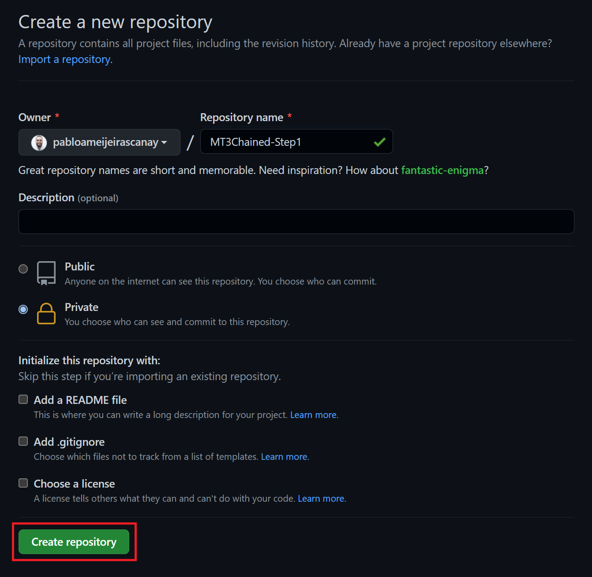

3. Repeat the process for the other services, including the Node JS service, but excluding the *Helm* folder (for now).

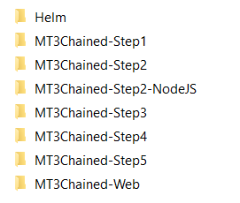

4. When you're done, your list should look like this:


### Task 2 - Initialize git, check in the source code and push it to GitHub (For all the repos, excluding the NodeJS step and web repo)

1. Initialize git, check in the source code and push it to GitHub for all step repos. **IMPORTANT: REPLACE THE *$GITHUB_ALIAS* VARIABLE WITH YOUR GITHUB ALIAS**.

```PowerShell
$GITHUB_ALIAS="ENTER YOUR GITHUB ALIAS"

ForEach ($i in 1..5) {
  cd "C:\k8s\Labs\MathTrick\Chained\MT3Chained-Step$i"
  Write-Host "==========================MT3Chained-Step$i==========================" -ForeGround Green
  git init
  git add .
  git commit -m "Initial check-in"
  git remote add origin "git@github.com:$GITHUB_ALIAS/MT3Chained-Step$i.git"
  git branch -M main
  git push -u origin main
}
```

2. Return back to the GitHub.  Select for example the **MT3Chained-Step1** repo, you should see all your files (the same for all the step repos).


3. Create two new repos called "**Math Trick 3 - Chained**" and "**MathTrickCore**" following the same steps for the others that you created.  Use the "**Math Trick 3 - Chained**" repo to store the contents of the "**Helm**" folder and use the "**MathTrickCore**" repo to store the contents of the "**MathTrickCore**" folder.

4. Initialize git, check in the source code and push it to GitHub for the **Math-Trick-3---Chained** repo.

```PowerShell
cd "C:\k8s\Labs\MathTrick\Chained\Helm"
git init
git add .
git commit -m "Initial check-in"
git remote add origin git@github.com:$GITHUB_ALIAS/Math-Trick-3---Chained.git
git branch -M main
git push -u origin main
```

5. Initialize git, check in the source code and push it to GitHub for the **MathTrickCore** repo.

```PowerShell
cd "C:\k8s\Labs\MathTrick\MathTrickCore"
git init
git add .
git commit -m "Initial check-in"
git remote add origin git@github.com:$GITHUB_ALIAS/MathTrickCore.git
git branch -M main
git push -u origin main
```

6. Now, for example you should see all the Helm files in the Math-Trick-3---Chained repo (the same for the MathTrickCore repo)


### Task 3 - Add the same secrets you added in the [Exercise: Create the Secrets for the GitHub repo](#exercise-create-the-secrets-for-the-github-repo)

1. For the *step* and *Step2-NodeJS* repos create the **ACR_CLIENT_ID** and **ACR_CLIENT_PASSWORD** secrets for the ACR authentication and **AZURE_CREDENTIALS** secret for the Azure Key Vault Authentication (Then we will assign the access policies to the Service Principal created). You can use the following links if you don't remember how to create the secrets:

[Task 2 - Create the GitHub Action Secret to manage the AKS cluster and the Azure Key Vault](#task-2---create-the-github-action-secret-to-manage-the-aks-cluster-and-the-azure-key-vault)

[Task 3 - Create the GitHub Actions Secrets for the Azure Container Registry Authentication](#task-3---create-the-github-actions-secrets-for-the-azure-container-registry-authentication)

2. For the *Math-Trick-3---Chained* repo create the **AZURE_CREDENTIALS** secret for the Azure Key Vault and AKS Authentication. You can use the following link if you don't remember how to create the secret:

[Task 2 - Create the GitHub Action Secret to manage the AKS cluster and the Azure Key Vault](#task-2---create-the-github-action-secret-to-manage-the-aks-cluster-and-the-azure-key-vault)

### Task 4 - Create a GitHub Token

Create a github token to use in the workflow.yaml of each step repos to access the *MathTrickCore* repo; and also for step, NodeJS and web repos to trigger the workflow of the *Math-Trick-3---Chained* when there is a change (it will be used in the last steps of the lab)

1. In the upper-right corner of any page, click on your profile photo, then click Settings.


2. In the left sidebar, click Developer settings.


3. In the left sidebar, click Personal access tokens.

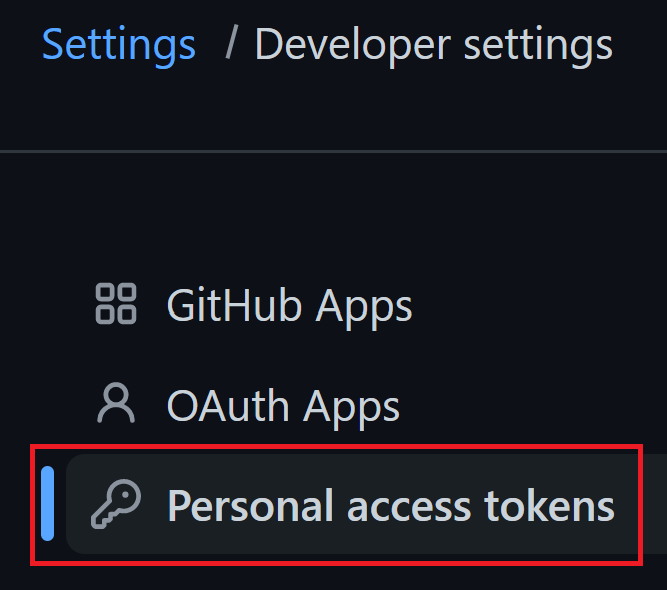

4. Click Generate new token.


5. Give your token a descriptive name.


6. To give your token an expiration, select the Expiration drop-down menu, then click a default or use the calendar picker.


7. Select the scopes, or permissions, you'd like to grant this token. To use your token to access other repositories, select repo.


8. Click Generate token.


9. Copy the token in a .txt file, it will be used to create a secret.

10. Create a Action Secret for all the ***step*** repos (including the **NodeJS step** and the **web** repo). Not all of them require the secret at this point, but they will in later Tasks. **Do not create the secret for *MathTrickCore* and the *Math-Trick-3---Chained* repos, as those projects don't need it.**

11. For example how to create the **PAT_GITHUB** secret for the *MT3Chained-Step1* repo, just copy the token which was created before and paste it in the Value section.


**IMPORTANT**: Repeat this secret creation for all the ***step*** repos (including the **NodeJS step** and the **web** repo).

### Task 5 - Create a new GitHub Action for the step repos

Create the **workflow.yaml** in the the directory of all the step repos **\\.github\workflows\\** from the **workflow-steps1.yaml** file, in the directory **C:\k8s\Labs\Module5\workflows**, with the following content:

> This workflow does the same as the first one for the web repo, but with one more step to access the *MathTrickCore* repo.

```yaml
name: <githubRepoName>

on:
  push:
    branches:
      - main

env:
  APP_NAME: <appName>
  LOGIN_SERVER: <acrServerName>

jobs:

  build:
    runs-on: ubuntu-latest
    steps:

      - name: Check-out Repo
        uses: actions/checkout@v2
        with:
          path: Chained/<githubRepoName>

      - name: Check-out MathTrickCore
        uses: actions/checkout@v2
        with:
          repository: <githubAlias>/MathTrickCore
          path: MathTrickCore
          token: ${{ secrets.PAT_GITHUB }}

      # Connect to Azure Container Registry (ACR)
      - name: ACR login
        uses: azure/docker-login@v1
        with:
          login-server: ${{ env.LOGIN_SERVER }}
          username: ${{ secrets.ACR_CLIENT_ID }}
          password: ${{ secrets.ACR_CLIENT_PASSWORD }}
      # Container build and push to a Azure Container Registry (ACR)
      - name: Build, tag, and push image to ACR
        uses: docker/build-push-action@v2
        with:
          context: ./
          file: Chained/<githubRepoName>/Dockerfile
          push: true
          tags: |
            ${{ env.LOGIN_SERVER }}/${{ env.APP_NAME }}:${{ github.run_number }}
            ${{ env.LOGIN_SERVER }}/${{ env.APP_NAME }}:latest
```

1. Create the **\.github\workflows** folder in the step repos.

```PowerShell
ForEach ($i in 1..5) {
  New-Item -Path "C:\k8s\Labs\MathTrick\Chained\MT3Chained-Step$i\.github\workflows" -ItemType Directory
}
```

2. Copy the following Azure PowerShell code in the Windows Terminal to replace the **workflow-steps1.yaml** file in the path **C:\k8s\Labs\Module5\workflows** with the correct values and give it the correct file name **(workflow.yaml)** copying it in **\\.github\workflows\\** folder of each step repo (excluding the NodeJS step and web repo).

```PowerShell
ForEach ($i in 1..5) {
  $PathTemplate="C:\k8s\Labs\Module5\workflows"
  $PathWorkflow="C:\k8s\Labs\MathTrick\Chained\MT3Chained-Step$i\.github\workflows"
  $original_file = (Join-Path $PathTemplate workflow-steps1.yaml)
  $destination_file = (Join-Path $PathWorkflow workflow.yaml)

  (Get-Content $original_file) | Foreach-Object {
    $_ -replace "<appName>", "mt3chained-step$i" `
       -replace "<githubRepoName>", "MT3Chained-Step$i" `
       -replace "<acrServerName>", $ACR_SERVER_NAME `
       -replace "<githubAlias>", $GITHUB_ALIAS
    } | Set-Content $destination_file

  # Commit and push workflow
  cd "C:\k8s\Labs\MathTrick\Chained\MT3Chained-Step$i\"
  Write-Host "==========================MT3Chained-Step$i==========================" -ForeGround Green
  git add .
  git commit -m "Add workflow.yaml"
  git push
}
```

3. After all the builds have completed, verify all the images have been created in the ACR.


### Task 6 - Configure the service principal to access the Key Vault created in Lab 4, Exercise 1, Task 2 to be used by your workflows

You created an Azure Key Vault in the previous module and set it's name in the **$KV_NAME** variable.

1. Create an Access Policy to allow the service principal to read and write secrets to the Key Vault, so the GitHub Action workflows can access to the Key Vault through the **AZURE_CREDENTIALS** secret.

```PowerShell
$OBJ_ID=$(az ad sp show --id $servicePrincipal.ApplicationId --query objectId -o tsv)
az keyvault set-policy --name $KV_NAME `
                       --resource-group $AKS_RESOURCE_GROUP `
                       --object-id $OBJ_ID `
                       --secret-permissions delete get list set
```

2. Open the Azure Portal, go to the Key Vault and click on **Access policies** to verify the access policy was created


3. Create the default image tags secrets for all the images.  Set the default tags to *latest* so you can use them until they're replaced with the build numbers in the pipelines

```PowerShell
az keyvault secret set --vault-name $KV_NAME --name "mt3chained-step1-tag" --value "latest"
az keyvault secret set --vault-name $KV_NAME --name "mt3chained-step2-tag" --value "latest"
az keyvault secret set --vault-name $KV_NAME --name "mt3chained-step2-nodejs-tag" --value "latest"
az keyvault secret set --vault-name $KV_NAME --name "mt3chained-step3-tag" --value "latest"
az keyvault secret set --vault-name $KV_NAME --name "mt3chained-step4-tag" --value "latest"
az keyvault secret set --vault-name $KV_NAME --name "mt3chained-step5-tag" --value "latest"
az keyvault secret set --vault-name $KV_NAME --name "mt3chained-web-tag" --value "latest"
```

4. On the Key Vault in the Azure Portal, click on **Secrets** to verify they were all created (you may need to click *Refresh*)

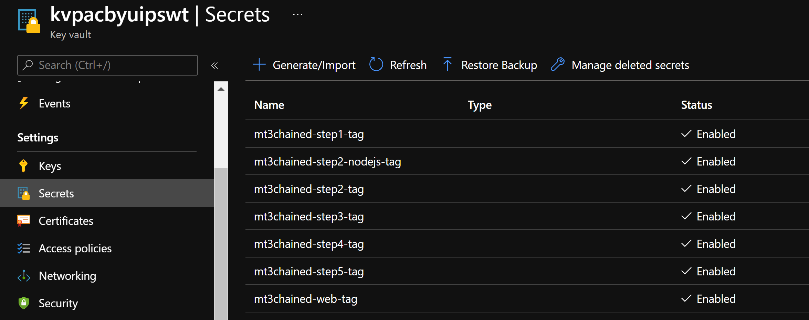

### Task 7 - Update the Build Pipelines to store image tags in Azure Key Vault

1. Edit the build workflow.yaml create in Task 5.

2. Add 2 env variables.

```yaml
  KV_NAME: <keyVaultName>
  SECRET_NAME: <appName>-tag
```

> Notice the *secretTagName* will match the secret name created in the previous task.

3. Add another task to the end of your workflow. The workflow will execute the same **az keyvault secret set** command that you executed above, except the *value* will be set to the current build tag (**github.run_number**).

```yaml
      - name: Azure login
        uses: azure/login@v1
        with:
          creds: ${{ secrets.AZURE_CREDENTIALS }}
      - run: |
          az keyvault secret set --vault-name ${{ env.KV_NAME }} --name ${{ env.SECRET_NAME }} --value ${{ github.run_number }}
```

4. Create the new **workflow.yaml** in the the directory of all the step repos **\\.github\workflows\\** from the **workflow-steps2.yaml** file, in the directory **C:\k8s\Labs\Module5\workflows**, with the following content:

```yaml
name: <githubRepoName>

on:
  push:
    branches:
      - main

env:
  APP_NAME: <appName>
  LOGIN_SERVER: <acrServerName>
  KV_NAME: <keyVaultName>
  SECRET_NAME: <appName>-tag

jobs:

  build:
    runs-on: ubuntu-latest
    steps:

      - name: Check-out Repo
        uses: actions/checkout@v2
        with:
          path: Chained/<githubRepoName>

      - name: Check-out MathTrickCore
        uses: actions/checkout@v2
        with:
          repository: <githubAlias>/MathTrickCore
          path: MathTrickCore
          token: ${{ secrets.PAT_GITHUB }}

      # Connect to Azure Container Registry (ACR)
      - name: ACR login
        uses: azure/docker-login@v1
        with:
          login-server: ${{ env.LOGIN_SERVER }}
          username: ${{ secrets.ACR_CLIENT_ID }}
          password: ${{ secrets.ACR_CLIENT_PASSWORD }}
      # Container build and push to a Azure Container Registry (ACR)
      - name: Build, tag, and push image to ACR
        uses: docker/build-push-action@v2
        with:
          context: ./
          file: Chained/<githubRepoName>/Dockerfile
          push: true
          tags: |
            ${{ env.LOGIN_SERVER }}/${{ env.APP_NAME }}:${{ github.run_number }}
            ${{ env.LOGIN_SERVER }}/${{ env.APP_NAME }}:latest
      - name: Azure login
        uses: azure/login@v1
        with:
          creds: ${{ secrets.AZURE_CREDENTIALS }}
      - run: |
          az keyvault secret set --vault-name ${{ env.KV_NAME }} --name ${{ env.SECRET_NAME }} --value ${{ github.run_number }}
```

5. Copy the following Azure PowerShell code in the Windows Terminal to replace the **workflow-steps2.yaml** file in the path **C:\k8s\Labs\Module5\workflows** with the correct values and replace the file **(workflow.yaml)** in **\\.github\workflows\\** folder of each step repo (excluding the NodeJS step and web repo).

```PowerShell
ForEach ($i in 1..5) {
  $PathTemplate="C:\k8s\Labs\Module5\workflows"
  $PathWorkflow="C:\k8s\Labs\MathTrick\Chained\MT3Chained-Step$i\.github\workflows"
  $original_file = (Join-Path $PathTemplate workflow-steps2.yaml)
  $destination_file = (Join-Path $PathWorkflow workflow.yaml)

  (Get-Content $original_file) | Foreach-Object {
    $_ -replace "<appName>", "mt3chained-step$i" `
       -replace "<githubRepoName>", "MT3Chained-Step$i" `
       -replace "<acrServerName>", $ACR_SERVER_NAME `
       -replace "<keyVaultName>", $KV_NAME `
       -replace "<githubAlias>", $GITHUB_ALIAS
    } | Set-Content $destination_file

  # Commit and push workflow
  cd "C:\k8s\Labs\MathTrick\Chained\MT3Chained-Step$i\"
  Write-Host "==========================MT3Chained-Step$i==========================" -ForeGround Green
  git add .
  git commit -m "Add workflow.yaml"
  git push
}
```

6. When the build completes successfully, go to the Azure Portal and look up the secrets in the key vault, click on the *mt3chained-step1-tag* secret for example.

7. Click on the link below the **CURRENT VERSION** of the secret.  Click the **Show Secret Value** button

8. The latest build tag should be in the value of the secret.

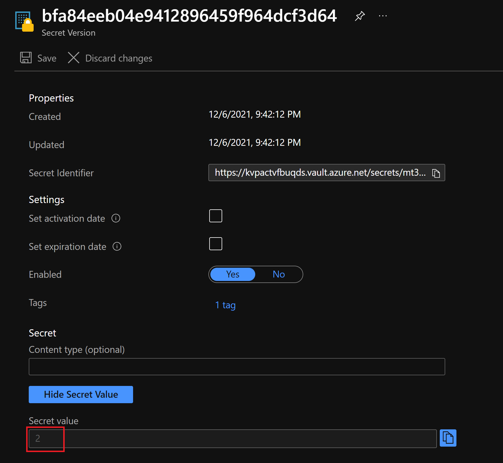

9. Which should match the last *github.run_number* tag in the ACR repository *mt3chained-step1*.

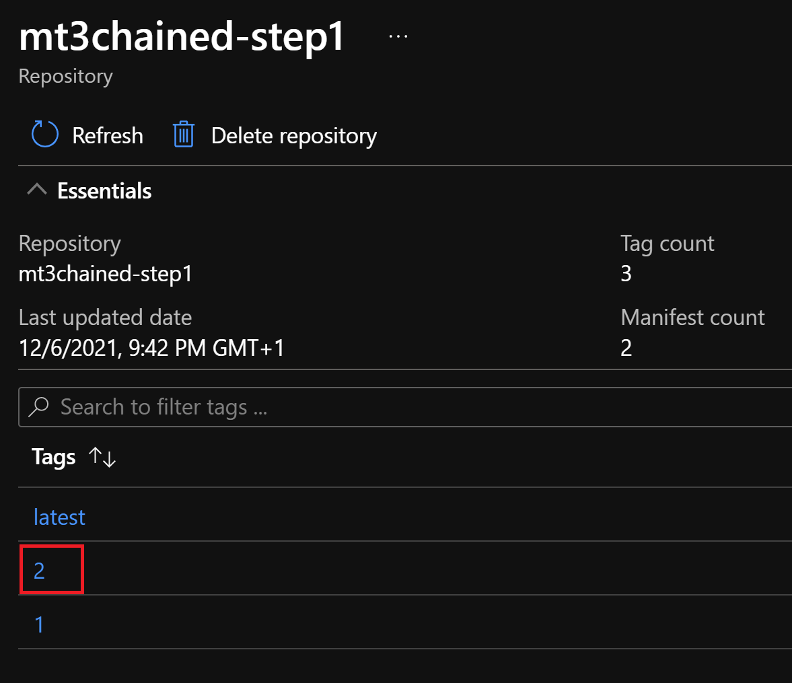

### Task 8 - Build the Pipelines for the Web and NodeJS microservice

1. The process is similar to the one followed in Task 7 above. We will create a workflow for the *MT3Chained Web* and the *MT3Chained-Step2-NodeJS* repos. This workflow's structure will be simpler than the structure of the ***step*** repositories, since these are self contained projects and don't require the obtention of dependencies of the *MathTrickCore* repo.

2. To create the new **workflow.yaml** in the the directory **\\.github\workflows\\** of *MT3Chained-Web* and the *MT3Chained-Step2-NodeJS* repos you will use the **workflow-web3.yaml** file, in the directory **C:\k8s\Labs\Module5\workflows**. It has 3 main steps: checkout, login into Azure, and image build and upload, and finally store the tag as a secret in the Azure Key Vault.

```yaml
name: <githubRepoName>

on:
  push:
    branches:
      - main

env:
  APP_NAME: <appName>
  LOGIN_SERVER: <acrServerName>
  KV_NAME: <azureKeyVaultName>
  SECRET_NAME: <secretName>
jobs:

  build:
    runs-on: ubuntu-latest
    steps:

      - name: Check-out Repo
        uses: actions/checkout@v2

      # Connect to Azure Container Registry (ACR)
      - name: ACR login
        uses: azure/docker-login@v1
        with:
          login-server: ${{ env.LOGIN_SERVER }}
          username: ${{ secrets.ACR_CLIENT_ID }}
          password: ${{ secrets.ACR_CLIENT_PASSWORD }}
      # Container build and push to a Azure Container Registry (ACR)
      - name: Build, tag, and push image to ACR
        uses: docker/build-push-action@v2
        with:
          push: true
          tags: |
            ${{ env.LOGIN_SERVER }}/${{ env.APP_NAME }}:${{ github.run_number }}
            ${{ env.LOGIN_SERVER }}/${{ env.APP_NAME }}:latest

      - name: Azure login
        uses: azure/login@v1
        with:
          creds: ${{ secrets.AZURE_CREDENTIALS }}
      - run: |
          az keyvault secret set --vault-name ${{ env.KV_NAME }} --name ${{ env.SECRET_NAME }} --value ${{ github.run_number }}
```

3. Copy the following Azure PowerShell code in the Windows Terminal to replace the **workflow-web3.yaml** file in the path **C:\k8s\Labs\Module5\workflows** with the correct values and replace the **(workflow.yaml)** file with the new content in the **\\.github\workflows\\** folder of web repo.

```PowerShell
$Path1="C:\k8s\Labs\Module5\workflows"
$Path2="C:\k8s\Labs\MathTrick\Chained\MT3Chained-Web\.github\workflows"
$original_file = (Join-Path $Path1 workflow-web3.yaml)
$destination_file = (Join-Path $Path2 workflow.yaml)
(Get-Content $original_file) | Foreach-Object {
    $_ -replace "<appName>", "mt3chained-web" `
       -replace "<githubRepoName>", "MT3Chained-Web" `
       -replace "<acrServerName>", $ACR_SERVER_NAME `
       -replace "<azureKeyVaultName>", $KV_NAME `
       -replace "<secretName>", "mt3chained-step1-web-tag"
    } | Set-Content $destination_file
```

4. Commit the changes and push them to the GitHub repository. This will also trigger the workflow execution.

```PowerShell
cd "C:\k8s\Labs\MathTrick\Chained\MT3Chained-Web"
git add .
git commit -m "Update workflow.yaml"
git push
```

5. We'll repeat the same process for the *MT3Chained-Step2-NodeJS* repo. The definition of the workflow is basically the same. But first we need to create the **\\.github\workflows\\** folder of NodeJS repo.

```PowerShell
New-Item -Path "C:\k8s\Labs\MathTrick\Chained\MT3Chained-Step2-NodeJS\.github\workflows" -ItemType Directory
```

6. Now, run the following script:

```PowerShell
$Path1="C:\k8s\Labs\Module5\workflows"
$Path2="C:\k8s\Labs\MathTrick\Chained\MT3Chained-Step2-NodeJS\.github\workflows"
$original_file = (Join-Path $Path1 workflow-web3.yaml)
$destination_file = (Join-Path $Path2 workflow.yaml)
(Get-Content $original_file) | Foreach-Object {
    $_ -replace "<appName>", "mt3chained-step2-nodejs" `
       -replace "<githubRepoName>", "MT3Chained-Step2-NodeJS" `
       -replace "<acrServerName>", $ACR_SERVER_NAME `
       -replace "<azureKeyVaultName>", $KV_NAME `
       -replace "<secretName>", "mt3chained-step2-nodejs-tag"
    } | Set-Content $destination_file
```

7. Init and Commit the changes and push them to the GitHub repository (As you can see we have some steps more as this repo wasn't initialized before). This will also trigger the workflow execution.

```PowerShell
cd "C:\k8s\Labs\MathTrick\Chained\MT3Chained-Step2-NodeJS"
git init
git add .
git commit -m "Initial check-in"
git remote add origin git@github.com:pabloameijeirascanay/MT3Chained-Step2-NodeJS.git
git branch -M main
git push -u origin main
```

8. Once the execution is over, verify the images in your  Azure Container Registry and the tags in your Azure Key Vault.

9. When all the workflows have run at least once. You can verify their status by selecting "Actions" tab and checking the execution log.

### Task 9 - Build a single Release Pipelines that uses Helm to update the AKS cluster

Now that all of the microservice images are automatically built, pushed and their tags are saved, it's time to create a workflow that is triggered automatically and updates the AKS cluster when **ANY** microservice is modified. This will require a small change in all the previously added workflows, as well as a workflow that contains a special trigger.

GitHub does not support triggering child workflows from outside of a repository. This means that, we either bundle the entire solution in a single repository, which would be undesirable, or we'll have to find a way to achieve the same behavior. Fortunately, this can be done by using a feature from the GitHub API called [workflow_dispatch](https://docs.github.com/en/actions/learn-github-actions/events-that-trigger-workflows#workflow_dispatch). Let's see how to add this event to our previous pipelines.

1. The use of the GitHub API requires us to authenticate ourselves to perform the required request. This means we need a personal access token available in the repositories that will trigger a deployment when updated. In Task 4 we have already taken care of this step but make sure that all our **step** repositories (Including NodeJS) and the **web** repository have the PAT_GITHUB secret created. This step is mandatory.

2. Once we have the required secrets in place, we have to add the following step at the end of each of our existing workflows.

```yaml
      # Issue workflow dispatch event to trigger Helm chart deployment
      - name: Invoke workflow in another repo with inputs
        uses: benc-uk/workflow-dispatch@v1
        with:
          workflow: Math-Trick-3---Chained
          repo: <githubAlias>/Math-Trick-3---Chained
          token: ${{ secrets.PAT_GITHUB }}
```

The code shown above uses an action to perform the API request that will trigger the workflow_dispatch event for the required repository and workflow. The `workflow` and `repo` parameters determine where the event will be sent. The `token` parameter should be passed the PAT_GITHUB secret we have defined for our repositories.

3. Copy the following Azure PowerShell code in the Windows Terminal to replace the **workflow-steps3.yaml** file in the path **C:\k8s\Labs\Module5\workflows** with the correct values and replace the **(workflow.yaml)** content in **\\.github\workflows\\** folder of all the step repos.

```PowerShell
ForEach ($i in 1..5) {
  $PathTemplate="C:\k8s\Labs\Module5\workflows"
  $PathWorkflow="C:\k8s\Labs\MathTrick\Chained\MT3Chained-Step$i\.github\workflows"
  $original_file = (Join-Path $PathTemplate workflow-steps3.yaml)
  $destination_file = (Join-Path $PathWorkflow workflow.yaml)

  (Get-Content $original_file) | Foreach-Object {
    $_ -replace "<appName>", "mt3chained-step$i" `
       -replace "<githubRepoName>", "MT3Chained-Step$i" `
       -replace "<acrServerName>", $ACR_SERVER_NAME `
       -replace "<keyVaultName>", $KV_NAME `
       -replace "<githubAlias>", $GITHUB_ALIAS
    } | Set-Content $destination_file
}
```

4. Copy the following Azure PowerShell code in the Windows Terminal to replace the **workflow-web4.yaml** file in the path **C:\k8s\Labs\Module5\workflows** with the correct values and replace the **(workflow.yaml)** content in **\\.github\workflows\\** folder of web repo.

```PowerShell
$Path1="C:\k8s\Labs\Module5\workflows"
$Path2="C:\k8s\Labs\MathTrick\Chained\MT3Chained-Web\.github\workflows"
$original_file = (Join-Path $Path1 workflow-web4.yaml)
$destination_file = (Join-Path $Path2 workflow.yaml)
(Get-Content $original_file) | Foreach-Object {
    $_ -replace "<appName>", "mt3chained-web" `
       -replace "<githubRepoName>", "MT3Chained-Web" `
       -replace "<acrServerName>", $ACR_SERVER_NAME `
       -replace "<azureKeyVaultName>", $KV_NAME `
       -replace "<secretName>", "mt3chained-web-tag" `
       -replace "<githubAlias>", $GITHUB_ALIAS
    } | Set-Content $destination_file
```

5. We'll repeat the same process for the *MT3Chained-Step2-NodeJS* repo as the web repo above. The definition of the workflow is basically the same.

```PowerShell
$Path1="C:\k8s\Labs\Module5\workflows"
$Path2="C:\k8s\Labs\MathTrick\Chained\MT3Chained-Step2-NodeJS\.github\workflows"
$original_file = (Join-Path $Path1 workflow-web4.yaml)
$destination_file = (Join-Path $Path2 workflow.yaml)
(Get-Content $original_file) | Foreach-Object {
    $_ -replace "<appName>", "mt3chained-step2-nodejs" `
       -replace "<githubRepoName>", "MT3Chained-Step2-NodeJS" `
       -replace "<acrServerName>", $ACR_SERVER_NAME `
       -replace "<azureKeyVaultName>", $KV_NAME `
       -replace "<secretName>", "mt3chained-step2-nodejs-tag" `
       -replace "<githubAlias>", $GITHUB_ALIAS
    } | Set-Content $destination_file
```

**DO NOT PUSH THE CHANGES YET, AS WE STILL NEED TO ADD THE WORKFLOW THAT WILL RECEIVE THE EVENTS**

6. Once the code repositories are ready, we need to create a workflow that will issue the deployment of our Helm chart. This workflow must be triggered in two circumstances. The first one would be the reception of the workflow_dispatch event, which would correspond to a change made to one of the subprojects (subrepos: step repos, NodeJS and web repo) that are part of the chart. The second is when changes to the Helm repository itself are performed. To do this, we have to make a slight modification to the `on` section of our workflow:

```yaml
on:
  workflow_dispatch: ~
  push:
    branches: [main]
```

This new definition will cause the workflow to execute following the rules we have previously explained.

7. This repository will connect to our Azure KeyVault and fetch the secrets corresponding to the versions of each of the apps in our solution. These secrets will be used to perform a variable replacement of the entries in the values.yaml file in the chart. We need two steps to perform these tasks. The convenience and versatility of GitHub actions and the workflow syntax can be seen again in this brief example. The chosen actions eliminate the need to manually perform the obtention of the secrets and the replacement of the values in the .yaml code, providing an easy to use alternative for common tasks.

```yaml
      # Get secrets
      - name: Get Keyvault secrets
        uses: Azure/get-keyvault-secrets@v1
        with:
          keyvault: ${{ env.KV_NAME }}
          secrets: 'mt3chained-step1-tag,mt3chained-step2-nodejs-tag,mt3chained-step2-tag,mt3chained-step3-tag,mt3chained-step4-tag,mt3chained-step5-tag,mt3chained-web-tag'
        id: versiontags

      - name: 'Set version tags'
        uses: microsoft/variable-substitution@v1
        with:
          files: mt3chained/values.yaml
        env:
          tags.mt3chainedweb: ${{ steps.versiontags.outputs.mt3chained-web-tag }}
          tags.mt3chainedstep1: ${{ steps.versiontags.outputs.mt3chained-step1-tag }}
          tags.mt3chainedstep2: ${{ steps.versiontags.outputs.mt3chained-step2-tag }}
          tags.mt3chainedstep2nodejs: ${{ steps.versiontags.outputs.mt3chained-step2-nodejs-tag }}
          tags.mt3chainedstep3: ${{ steps.versiontags.outputs.mt3chained-step3-tag }}
          tags.mt3chainedstep4: ${{ steps.versiontags.outputs.mt3chained-step4-tag }}
          tags.mt3chainedstep5: ${{ steps.versiontags.outputs.mt3chained-step5-tag }}
```

8. Before we attempt to deploy our chart, we need to set the AKS context.

```yaml
      - name: Azure Kubernetes set context
        uses: Azure/aks-set-context@v1
        with:
          creds: ${{ secrets.AZURE_CREDENTIALS }}
          resource-group: ${{ env.AKS_RESOURCE_GROUP }}
          cluster-name: ${{ env.AKS_NAME }}
```

9. Once our AKS context is set, we must install Helm.

```yaml
      - name: Helm tool installer
        uses: Azure/setup-helm@v1
```

10. Finally, we just have to run the Helm command to install/upgrade a release.

```yaml
      - name: Deploy
        run: |
          helm upgrade --install chained mt3chained/
```

11. The complete workflow for the Helm repository will look like this:

```yaml
name: Math-Trick-3---Chained

on:
  workflow_dispatch: ~
  push:
    branches: [main]

env:
  KV_NAME: <azureKeyVaultName>
  AKS_NAME: <aksName>
  AKS_RESOURCE_GROUP: <aksResourceGroup>

jobs:

  deploy-to-aks:
    runs-on: ubuntu-latest
    steps:

      - name: 'Checkout'  # Checkout the repository code.
        uses: 'actions/checkout@v1'

      # Connect to Azure
      - name: Azure login
        uses: azure/login@v1
        with:
          creds: ${{ secrets.AZURE_CREDENTIALS }}

      # Get secrets
      - name: Get Keyvault secrets
        uses: Azure/get-keyvault-secrets@v1
        with:
          keyvault: ${{ env.KV_NAME }}
          secrets: 'mt3chained-step1-tag,mt3chained-step2-nodejs-tag,mt3chained-step2-tag,mt3chained-step3-tag,mt3chained-step4-tag,mt3chained-step5-tag,mt3chained-web-tag'
        id: versiontags

      - name: 'Set version tags'
        uses: microsoft/variable-substitution@v1
        with:
          files: mt3chained/values.yaml
        env:
          tags.mt3chainedweb: ${{ steps.versiontags.outputs.mt3chained-web-tag }}
          tags.mt3chainedstep1: ${{ steps.versiontags.outputs.mt3chained-step1-tag }}
          tags.mt3chainedstep2: ${{ steps.versiontags.outputs.mt3chained-step2-tag }}
          tags.mt3chainedstep2nodejs: ${{ steps.versiontags.outputs.mt3chained-step2-nodejs-tag }}
          tags.mt3chainedstep3: ${{ steps.versiontags.outputs.mt3chained-step3-tag }}
          tags.mt3chainedstep4: ${{ steps.versiontags.outputs.mt3chained-step4-tag }}
          tags.mt3chainedstep5: ${{ steps.versiontags.outputs.mt3chained-step5-tag }}

      - name: Azure Kubernetes set context
        uses: Azure/aks-set-context@v1
        with:
          creds: ${{ secrets.AZURE_CREDENTIALS }}
          resource-group: ${{ env.AKS_RESOURCE_GROUP }}
          cluster-name: ${{ env.AKS_NAME }}

      - name: Helm tool installer
        uses: Azure/setup-helm@v1

      - name: Deploy
        run: |
          helm upgrade --install chained mt3chained/
```

12. But first we need to create the **\\.github\workflows\\** folder of Helm repo.

```PowerShell
New-Item -Path "C:\k8s\Labs\MathTrick\Chained\Helm\.github\workflows" -ItemType Directory
```

13. Copy the following Azure PowerShell code in the Windows Terminal to replace the **workflow-helm.yaml** file in the path **C:\k8s\Labs\Module5\workflows** with the correct values and give it the correct file name **(workflow.yaml)** copying it in **\\.github\workflows\\** folder of Helm repo.

```PowerShell
$Path1="C:\k8s\Labs\Module5\workflows"
$Path2="C:\k8s\Labs\MathTrick\Chained\Helm\.github\workflows"
$original_file = (Join-Path $Path1 workflow-helm.yaml)
$destination_file = (Join-Path $Path2 workflow.yaml)
(Get-Content $original_file) | Foreach-Object {
    $_ -replace "<azureKeyVaultName>", $KV_NAME `
       -replace "<aksName>", $AKS_NAME `
       -replace "<aksResourceGroup>", $AKS_RESOURCE_GROUP
    } | Set-Content $destination_file
```

14. Copy the following Azure PowerShell code in the Windows Terminal to replace the **values.yaml** file in the path **C:\k8s\Labs\MathTrick\Chained\Helm\mt3chained** with your correct Azure Container Registry name.

```PowerShell
$Path="C:\k8s\Labs\MathTrick\Chained\Helm\mt3chained"
(Get-Content (Join-Path $Path values.yaml)).replace("kizacr.azurecr.io", $ACR_SERVER_NAME) | Set-Content (Join-Path $Path values.yaml)
```

### Task 10 - Push the changes

1. Once the Helm workflow is ready, we'll commit and push the changes. This will trigger the execution of the workflow.

```PowerShell
cd "C:\k8s\Labs\MathTrick\Chained\Helm"
git add .
git commit -m "Create the workflow.yaml and update the values.yaml"
git push
```

> Note that the execution of this workflow requires the docker images for all the projects to be present in the ACR. This means at least one correct execution of the workflow for each of the projects is required.

2. Wait to see the Helm github action finished.

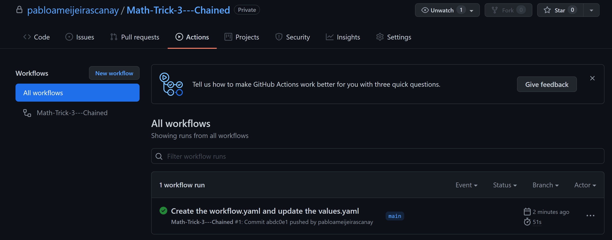

3. Now, we can push the changes for the ***step***, **NodeJS** and ***web*** repos. From this point onwards, any change to these projects will also cause the deployment of the chart. Copy the following script in your Windows Terminal:

```PowerShell
ForEach ($i in 1..5) {
  cd "C:\k8s\Labs\MathTrick\Chained\MT3Chained-Step$i\"
  Write-Host "==========================MT3Chained-Step$i==========================" -ForeGround Green
  git add .
  git commit -m "Add workflow.yaml"
  git push
  Start-Sleep -s 60
}

cd "C:\k8s\Labs\MathTrick\Chained\MT3Chained-Step2-NodeJS\"
git add .
git commit -m "Add workflow.yaml"
git push
Start-Sleep -s 60

cd "C:\k8s\Labs\MathTrick\Chained\MT3Chained-Web\"
git add .
git commit -m "Add workflow.yaml"
git push
```

---
> The command *Start-Sleep -s 60* is just to avoid the following error:


> This happens because each of the above pushes will create a trigger for the workflow in the *Math-Trick-3---Chained* repo, and without the *Start-Sleep -s 60* command there would be 7 *helm upgrade --install chained mt3chained/* running at the same time.
---

4. Assuming the pipeline succeeds, check the cluster to verify everything has been deployed and is running.

```PowerShell
kubectl get all -n chained
```

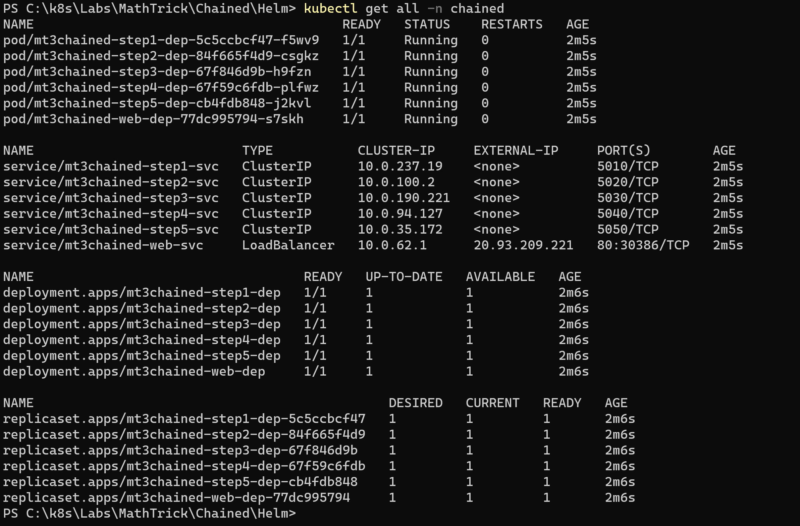

5. Open a browser and enter the EXTERNAL-IP address listed for the Load Balancer service.

6. Click the Start button to ensure all the services are connected.

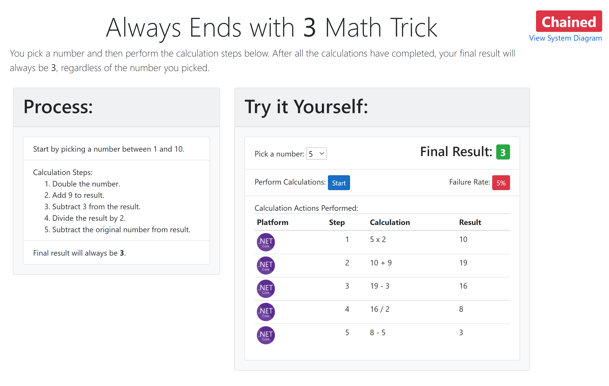

7. Verify that the Helm pipeline used all the tags from the Key Vault and replaced all the tags successfully, including the ACR.

```PowerShell
helm get values chained -a
```

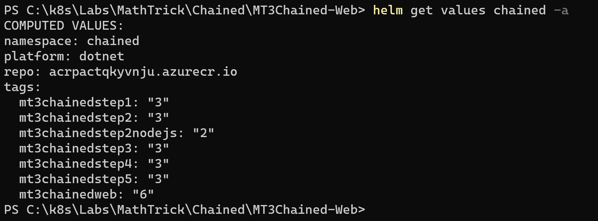

8. Finally, confirm that the entire process is working correctly by adding a test file in any microservice and check it in.

```PowerShell
## Change into any of the microservice folders
echo "Test" > pipeline.txt
git add .
git commit -m "Pipeline test"
git push
```

9. Wait a few minutes to ensure that **ONLY** that effected Pod was automatically replaced with the new version.

```PowerShell
kubectl get all -n chained
```


**CONGRATULATIONS!!!**  You now have a "practical" pipeline you can use as a template for complex microservices applications.
